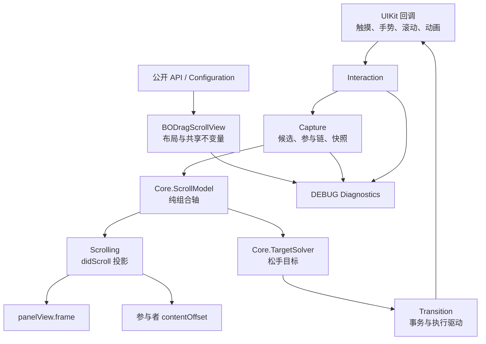

# Swift 架构与模块边界

## 1. 设计目标

`BODragScroll` 是原 `BODragScrollView` 的 Swift 重写。目标不是逐行翻译，而是在保持可观察行为和手感参数的前提下，把原单文件中混合的职责拆成三类：

1. 业务可理解的能力：面板、展示高度、吸附、内部滚动交接、手势和辅助功能；
2. UIKit 适配：响应链捕获、布局、系统回调、动画和兼容时机；
3. 无 UIKit 的纯计算：组合滚动轴、投影和松手目标求解。

结构设计遵循两个限制：

- 不把一个 `.m` 机械切成大量微型文件；一个文件应拥有完整的状态或生命周期阶段。
- 高频路径不临时推导复杂规则；捕获时构建模型，滚动时只投影缓存模型。

## 2. 核心命名

| Swift 名称 | 含义 | 原 OC 概念 |
| --- | --- | --- |
| `panelView` | 固定尺寸、被展示和拖动的业务面板 | `embedView` |
| `displayHeight` | 面板当前实际可见高度 | `currDisplayH` |
| `primaryParticipantScrollView` | 本次捕获链中最内层的主参与者 | `currentScrollView` |
| `participantChain` | 主参与者到可参与祖先的有序链 | `_currentScrollView` + `nestSvAr` |
| `detentHeights` | 松手可吸附的面板展示高度 | `attachDisplayHAr` |
| `ScrollSegment` | 组合轴上的面板锚点或内部滚动区间 | `BODragScrollAttachInfo` |

“捕获”不等于只找到一个 ScrollView。捕获先发现候选，再选择主参与者，最后把配置为 `.participant` 的可滚动祖先加入参与链。一个祖先可能因为子视图位于内容中部而被拆成前、后两个不连续区间。

## 3. 总体分层

依赖方向是单向的：UIKit 层可以创建纯值快照并调用 Core；Core 不引用 `UIView`、`UIScrollView`、delegate 或手势。

## 4. 从功能理解到真实代码

| 人类理解的功能 | 主要实现位置 | 边界 |
| --- | --- | --- |
| 数组索引便利方法 | `Core/BODragScrollModel.swift` 的 `bo_findIndex`、`ScrollMath` | 保留 `NSNumber.floatValue` 的 Float32 语义 |
| 不同系统的 inset 抽象 | `BODragScrollUIScrollViewBridge.swift` 的 `effectiveContentInset` | UIKit 兼容层，不进入纯模型 |
| ScrollView 状态兼容/swizzle | `BODragScrollUIScrollViewBridge.swift` | 只桥接当前主参与者的公开状态 getter |
| 系统触摸结束时机补完 | `TouchCompletionGestureRecognizer` | 只补齐“停止动画但未开始拖动”的触摸结束 |
| 吸附点与内部区间数据 | 公开 `BODragScrollInnerScrollSegment`；内部 `ScrollSegment` | 公开输入与构建后模型分离 |
| 行为属性 | `BODragScrollConfiguration` 的 handoff/bounce/capture/gesture/movement/indicator | provider 负责动态决策，configuration 负责稳定策略 |
| 内部工作状态 | `BODragScrollRuntimeState` 的分组状态 | 每组状态由对应功能文件拥有 |
| 手指按下、捕获与建模 | `BODragScrollInteraction.swift` → `BODragScrollCapture.swift` | 按响应链生成一次 capture session |
| 滑动过程 | `BODragScrollScrolling.swift` | 只使用缓存模型投影并发布回调 |
| 手指抬起与惯性 | `BODragScrollTransition.swift` + `Core/BODragScrollTargetSolver.swift` | 求解与 UIKit 执行分离 |
| pointInside/hitTest/Web/UIControl | `BODragScrollInteraction.swift` | 处理 presentation layer、减速中断和特殊控件 |
| 布局 | `BODragScrollView.swift` | panel 尺寸、外层 inset、首次与尺寸变化布局 |
| 当前内部 ScrollView、刷新和监听 | `BODragScrollCapture.swift` | session、KVO、层级快照、reload 和失效清理 |
| `displayHeight` 与外部移动 | `BODragScrollView.swift`、`BODragScrollTransition.swift` | 几何事实与移动事务分离 |
| 手势冲突 | `BODragScrollInteraction.swift` | provider 可决策，Demo 诊断只观察不干预 |
| accessibility | `BODragScrollInteraction.swift`、`BODragScrollTransition.swift` | 复用同一移动事务和面板边界 |
| 调试日志 | `BODragScrollDiagnostics.swift` | DEBUG-only SPI，不参与任何业务决策 |

## 5. 源码文件与职责

生产实现由九个运行文件和一个 DEBUG 诊断文件组成。

| 文件 | 所有权与职责 | 不应承担的职责 |
| --- | --- | --- |
| `BODragScrollTypes.swift` | 公开类型、配置、behavior provider、event delegate | UIKit 状态和模型实现 |
| `BODragScrollView.swift` | 公开入口、panel 布局、共享几何、运行状态容器 | 捕获算法和目标求解 |
| `BODragScrollUIScrollViewBridge.swift` | 有效 inset、受保护写入、层级身份快照、主参与者状态桥接 | 业务交接策略 |
| `BODragScrollCapture.swift` | 候选发现、主参与者与祖先链、session 生命周期、KVO、模型快照 | 高频 didScroll 和动画事务 |
| `Core/BODragScrollModel.swift` | 数值语义、嵌套拆段、组合轴构建、投影 | UIKit 对象和回调 |
| `Core/BODragScrollTargetSolver.swift` | 松手分类、吸附、非吸附区间和目标选择 | 修改任何视图 |
| `BODragScrollScrolling.swift` | 高频滚动投影、bounce 分配、错位恢复、指示器 | 重建捕获候选 |
| `BODragScrollTransition.swift` | 程序化移动、拖拽/减速生命周期、transaction、动画驱动、scroll-to-top | 捕获候选发现 |
| `BODragScrollInteraction.swift` | 命中测试、系统触摸补完、手势仲裁、Web/UIControl、accessibility | 组合轴数学计算 |
| `BODragScrollDiagnostics.swift` | DEBUG Demo 观察事件 | 改变捕获、手势或滚动结果 |

`Capture` 和 `Transition` 行数较多，但各自仍是单一内聚管线：前者拥有“从触摸到可用模型”，后者拥有“从移动意图到唯一终态”。仅按行数继续拆分会迫使状态机跨文件暴露更多内部方法，因此当前不再细拆。

## 6. 状态所有权

`BODragScrollRuntimeState` 不是一个平铺的大属性集合，而是按修改者分组：

| 状态组 | 主要所有者 | 典型内容 |
| --- | --- | --- |
| `panel` | View/Layout | 上次 bounds、首次布局、待布局高度、panel 替换代次 |
| `capture` | Capture | session、KVO、操作 epoch、窗口切换暂停状态 |
| `drag` | View/Scrolling | 最近一次运动来源 |
| `scrolling` | Scrolling | 错位恢复方向、回调 epoch、内部滚动发布状态 |
| `transition` | Transition | transaction、驱动、动画监视、拖拽与减速配对 |
| `interaction` | Interaction | 触摸补完手势、Web 命中、延迟 UIControl |
| `debug` | Diagnostics（仅 DEBUG） | 日志 sink 和触摸序列号 |

共享的 `mutationDepth` 使组件对自身几何的成组写入可重入安全。UIKit setter 可能同步触发 delegate 或业务代码；内部写入期间收到的新移动请求会进入有序延迟队列，在原子几何更新完成后执行。

## 7. Capture Session

一次 capture session 持有：

- 稳定的 session ID；
- 主参与者和 `primary → ancestors` 参与链；
- 捕获层级弱引用快照；
- 当前构建的 `ScrollModel`；
- 参与者观察与恢复所需状态。

Session 使用弱引用，不延长业务视图生命周期。每次捕获、重建或清理都会推进 operation epoch；调用 provider、participant delegate 或 UIKit setter 后必须再次校验 session、epoch 和层级，防止同步重入的旧调用覆盖新状态。

## 8. 决策输入与事件输出

组件刻意拆开两个协议：

- `BODragScrollBehaviorProvider`：同步决策，包括 panel 尺寸、捕获候选、显式区间、目标修正、手势和 accessibility。
- `BODragScrollEventDelegate`：只接收 displayHeight、滚动、移动和拖拽生命周期通知。

这样可以避免一个 delegate 同时既修改决策又消费结果。任何 provider 回调都可能重入，因此调用前后使用 `BODragScrollDecisionStateToken` 验证几何和策略输入是否仍是同一版本。

## 9. 关键不变量

1. `panelView` 尺寸在一次运动中保持固定；展示变化来自外部 offset 与 panel translation。
2. `displayHeight` 来自当前几何或同一模型投影，不从未初始化/可选的吸附结果推断。
3. `UIScrollView.delegate` 由组件自己持有；业务只能使用 provider 和 event delegate。
4. 一个 capture session 的 `ParticipantID` 稳定，Core 不依赖对象指针。
5. `ScrollSegment` 按组合外轴有序，内部区间长度非负，同一参与者的区间不倒退或重叠。
6. 无 detent 表示连续面板，不表示禁用内部联动；有可参与内部范围时仍建立 participant segment，但松手不吸附。
7. 高频 `scrollViewDidScroll` 先更新 panel frame，再写参与者 offset，避免特殊 ScrollView 在布局时校正 offset 造成顺序错误。
8. 每个移动 transaction 最多完成一次；替换请求、移出窗口和布局失效会显式结束旧事务。

## 10. 为什么 Swift 不存在 OC 本次回归

Swift 的“是否建立参与段”和“是否存在 detent”是两条独立规则：

- `makeParticipantSegments` 只要捕获对象可参与，且没有有效显式区间，就会生成默认 participant segment；
- `automaticActivationScalar` 在 detent 为空时选择 `.native(currentDisplayHeight)`；
- `TargetSolver` 在没有 detent 时原样保留系统预测，不进行吸附；
- `ResolvedReleaseTarget` 是完整值类型，最终高度统一来自 `model.projection(at:)`。

因此不会出现“无 detent 导致没有内部段”，也不存在 OC 的未初始化 `attachInfo` 输出。

## 11. 修改结构时的判断标准

新增文件前先判断是否同时满足：

- 有独立状态所有权或完整生命周期阶段；
- 能减少依赖方向，而不是只减少单文件行数；
- 不迫使大量 `private` 状态改成跨文件可见；
- 可由独立测试覆盖。

纯 helper、单个公式或只有一个调用点的构造逻辑通常应留在其所有者文件中。新的纯算法如果可以脱离 UIKit 测试，才适合进入 `Core`。
