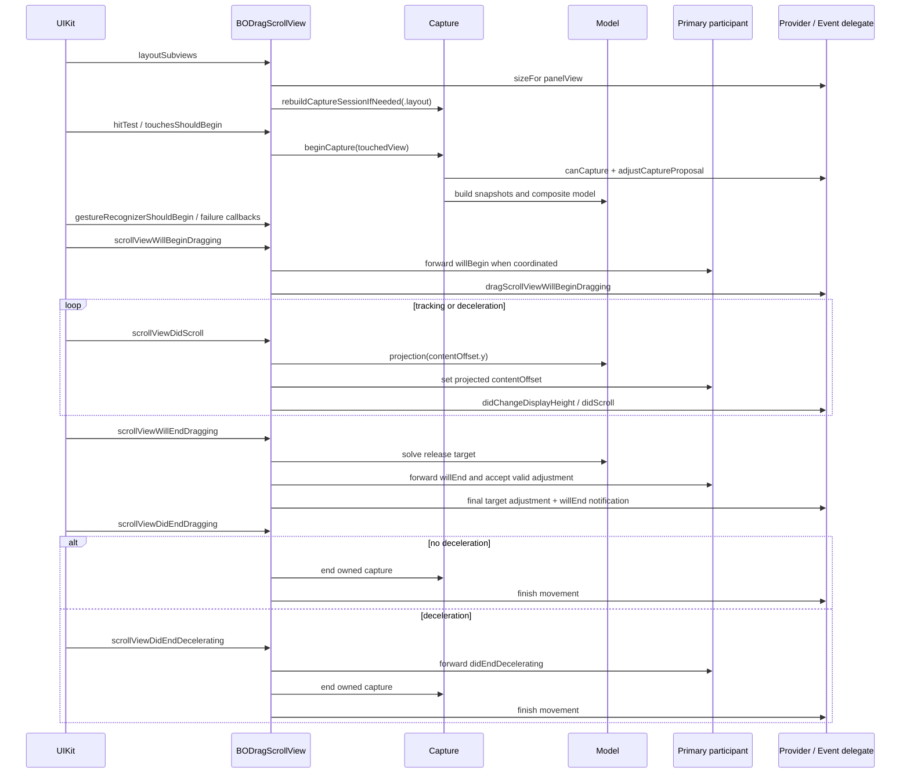

# BODragScroll UIKit 交互生命周期

本文按 UIKit 实际回调顺序说明当前 Swift 实现如何完成布局、触摸捕获、手势仲裁、拖动、释放、减速、动画、辅助功能和清理。数学映射另见 [`SCROLL_MODEL.md`](SCROLL_MODEL.md)。

主要代码边界：

| 文件 | 生命周期职责 |
| --- | --- |
| [`BODragScrollView.swift`](../Sources/BODragScroll/BODragScrollView.swift) | 初始化、公开状态、面板布局、几何原子更新 |
| [`BODragScrollInteraction.swift`](../Sources/BODragScroll/BODragScrollInteraction.swift) | hit-test、触摸时机补完、手势冲突、Web/UIControl、accessibility |
| [`BODragScrollCapture.swift`](../Sources/BODragScroll/BODragScrollCapture.swift) | responder-chain 捕获、会话所有权、KVO、模型重建与清理 |
| [`BODragScrollScrolling.swift`](../Sources/BODragScroll/BODragScrollScrolling.swift) | 高频 `scrollViewDidScroll` 投影和回弹归属 |
| [`BODragScrollTransition.swift`](../Sources/BODragScroll/BODragScrollTransition.swift) | 拖动/减速回调配对、释放目标、移动 transaction 和动画完成 |
| [`BODragScrollUIScrollViewBridge.swift`](../Sources/BODragScroll/BODragScrollUIScrollViewBridge.swift) | `UIScrollView` 状态 getter 兼容桥、capture lease、层级身份 |
| [`BODragScrollDiagnostics.swift`](../Sources/BODragScroll/BODragScrollDiagnostics.swift) | DEBUG-only 观察事件；只报告已经作出的决定 |

所有 UIKit 状态机代码都运行在 `@MainActor`。

## 1. 总体时序



这是主路径。布局变化、同步 client 回调、新 movement、window 移除和触摸中断都可能提前替换当前意图，因此实现处处使用 session/transaction/epoch 身份检查，而不是假设一次方法调用能不受重入地执行到底。

## 2. 运行时状态由谁拥有

`BODragScrollRuntimeState` 把内部状态按责任分组：

| 状态组 | 关键内容 |
| --- | --- |
| `panel` | 上次 bounds、是否完成首轮布局、待布局高度、面板替换 generation |
| `capture` | 当前 capture session、session/ownership 序号、操作 epoch、lease 清理 |
| `drag` | 最近一次运动来源：panel 或 participant |
| `scrolling` | offset mismatch 方向、恢复状态、didScroll callback epoch、指示器状态 |
| `transition` | movement transaction、当前 driver、拖动/减速配对、布局中断、动画监控 |
| `interaction` | 触摸补完 recognizer、延迟 UIControl、Web 命中状态 |
| `debug` | DEBUG-only sink 和触摸序号 |

另外有两个全局防护概念：

- `mutationDepth`：外层几何正在原子写入时抑制引擎自己的递归 `didScroll`。
- `decisionGeometryRevision`：公开几何或策略改变时使旧决策 token 失效。

## 3. 初始化与 UIScrollView 不变量

`commonInit()` 完成：

1. 永久安装 `UIScrollView.isDragging/isTracking/isDecelerating` getter bridge。
2. 将继承的 `delegate` 固定为 `self`。
3. 设置 `.never` 的 inset adjustment、`.fast` 减速、关闭 host 指示器和 `scrollsToTop`。
4. 允许取消 content touch，不延迟 content touch。
5. 安装 `TouchCompletionGestureRecognizer`。

外部不能把继承的 `delegate` 换成业务对象：

- 设置 `nil` 被忽略，以兼容通用 teardown 代码和 UIKit 析构过程。
- 设置其它对象在 Debug 触发 assertion。
- 同步决策使用 `behaviorProvider`，事件通知使用 `eventDelegate`。

这保证所有 `UIScrollViewDelegate` 生命周期都先经过组件自己的状态机。

## 4. 布局生命周期

### 4.1 `layoutSubviews`

每次布局记录旧 bounds。若 viewport 尺寸变化且已有有效布局：

1. 从 presentation layer 读取屏幕上正在显示的 outer offset 和 panel origin。
2. 按旧 viewport 计算当前真实可见高度。
3. 标记 transition 布局失效并中断旧 movement。
4. 保存该展示高度供新布局恢复。
5. 若 UIKit 正在减速，立即停止旧减速。

随后在首次布局、尺寸变化或 `invalidatePanelLayout()` 请求下执行 `layoutPanel(previousBounds:)`。

### 4.2 面板尺寸和初始高度

展示高度的优先来源是：

1. 首次布局前的非动画 movement 请求；
2. 尺寸变化前保存的 presentation 高度；
3. 首次布局的 `effectiveMinimumDisplayHeight`；
4. 旧 frame 与 offset 推导出的当前高度。

然后同步询问：

```swift
behaviorProvider.dragScrollView(
    self,
    sizeFor: panelView,
    firstLayout: firstLayout,
    proposedDisplayHeight: &proposedDisplayHeight
)
```

尺寸无效时先用 `sizeThatFits`，仍无效则回退 viewport 宽高。provider 回调后会核对 panel replacement generation、provider 身份和 pending transaction，避免把旧回调结果应用到新面板。

### 4.3 基础 panel-only 几何

布局先安装一致的基础状态：

```text
panelView.frame.minY = 0
outer contentSize.height = panelView.frame.height
outer contentOffset.y = proposedDisplayHeight - bounds.height
```

外层 inset 由最小/最大配置展示高度得到。完成基础几何后：

1. 标记 panel layout ready。
2. 重建已有 capture session 的组合模型。
3. 发布最终 `displayHeight`。
4. 完成尺寸变化导致的旧 transaction 中断。
5. 执行首次布局前挂起的 movement。

### 4.4 `invalidatePanelLayout()`

当安全区或业务 sizing 输入变化、但 host bounds 没变时，公开方法 `invalidatePanelLayout()` 走与尺寸变化相同的中断/保高路径。它不会要求替换 `panelView`。

## 5. 命中测试

### 5.1 可见区域

`point(inside:with:)` 和 `hitTest(_:with:)` 都使用 `panelView.layer.presentation()`；因此 UIView 动画期间的可点击区域跟随屏幕上的面板，而不是提前跳到 model layer 终点。

命中范围仅是 panel 自己实际可见且可响应的区域。没有 panel、隐藏、禁用交互或 alpha 过低时返回 nil。

### 5.2 惯性期间选择谁接收中断触摸

若 host 正在 view transition 或原生减速：

- 最近一次运动来自 participant：触摸落在主参与者深层内容时，返回命中路径上最近的嵌套 scroll view；找不到则返回主参与者。这样中断惯性不会误触下面的 control 或 Web 内容。
- 最近一次运动来自 panel：只读扫描本次命中链，返回首选内部 scroll view；没有则返回 host 自己。

如果 host 没在减速，但命中链上某个嵌套 scroll view 独立减速，hit-test 先返回那个 scroll view，让 UIKit 先停止它的惯性。

## 6. 手指按下与响应链捕获

### 6.1 `touchesShouldBegin`

组件在调用 `super.touchesShouldBegin` 前执行 `interaction_touchesShouldBegin`：

1. DEBUG 模式记录触摸开始。
2. 必要时补发 UIControl `.touchDown`。
3. 从 UIKit 给出的最深 `view` 调用 `beginCapture(from:)`。
4. 保存本次是否命中 WKWebView。
5. DEBUG 模式在决策完成后报告 capture/model；日志不参与选择。

### 6.2 responder-chain 扫描

`scanCandidates` 从最深命中 responder 向 `BODragScrollView` 方向遍历。只把启用的 `UIScrollView` 放进候选列表，同时记录：

- responder 深度；
- 使用 `adjustedContentInset` 判断的纵向/横向可滚性；
- provider 的 `canCapture` 结果；
- 是否经过 `WKWebView`。

默认主候选是最内层第一个纵向可滚 scroll view。若没有，则使用 frame 高度最大的可捕获 fallback。纯横向候选默认保留给 UIKit，不自动成为联动参与者。

### 6.3 proposal 决策

只要没有因为离屏/捕获暂停或 Web 禁用策略提前退出，扫描后就会调用 `adjustCaptureProposal`，包括 0、1 或多个候选，以及 WKWebView 内只有一个候选的情况。provider 可以：

- 把 `primaryCandidateID` 改成另一个已扫描且可捕获的候选；
- 设为 nil 拒绝捕获；
- 调整每个候选的 `BODragScrollCapturePriority`。

主候选最终强制标为 `.participant`。位于主候选外侧、纵向可滚且同样为 `.participant` 的祖先按 responder 顺序加入 `participantChain`。

provider 是任意同步业务代码。返回后引擎会不再询问策略地重新扫描一次，要求物理候选链和 Web 身份没有变化；否则放弃旧操作。

### 6.4 Web 边界

- `disablesPanelInteractionInWebView == true`：命中 Web 时结束 capture，之后 host pan 的 shouldBegin 返回 false。
- `ignoresMultipleNestedWebScrollViews == true`：从主候选到 Web 容器若发现至少两个纵向 scroll layer，结束 capture，让 Web/UIKit 自己处理。
- 非主手势的 simultaneous 规则不会与主参与者下面的 recognizer 共存，避免 Web 内两层同时滚动。

### 6.5 capture session 和独占 lease

安装 session 前会创建 `BODragScrollCaptureHierarchySnapshot`，弱持有并记录：

- host、panel 和参与者身份；
- 从主参与者到 panel 的每一条精确 superview 边。

仅仅“仍是 descendant”不够；插入 wrapper/scroll ancestor 或 reparent 都会让旧快照失效。

同一物理 scroll view 同时只能被一个有效 session 租用。lease 会：

- 保存并暂时关闭原 `scrollsToTop`；
- 拒绝另一个仍有效 host 的抢占；
- 回收层级已失效的孤儿 lease；
- 在释放时恢复原值。

同一条链再次捕获时优先复用 session，刷新 `ownershipGeneration` 和模型；链变化时先完整 teardown 旧 session，再创建从 1 开始的稳定 `ParticipantID`。

## 7. 模型重建时机

`rebuildCaptureSessionIfNeeded` 的 reason 包括：

- `.initialCapture`：按下建立或刷新 capture；
- `.layout`：panel/viewport 重新布局；
- `.observedMetrics`：参与者 `contentSize/contentInset/adjustedContentInset` 变化；
- `.mismatchRecovery`：拖动进入可恢复方向；
- `.explicitReload`：外部调用 `reloadScrollMetrics()`。

`BODragScrollCaptureRebuildReason` 还声明了 `.configuration`，但当前配置 setter 实际调用 `reloadScrollMetrics()`，因此当前调用路径的 reason 是 `.explicitReload`。

每个参与者使用 KVO 观察上述 metrics，回到主队列后核对 session ID、participant ID、对象身份和 `isInternallyMutating`，再触发重建。

`reloadScrollMetrics()` 先更新 panel-only outer inset 并保持当前 offset，再重建当前 capture。

### 7.1 handoff mode

- `.coordinated`：构建组合模型，由 host pan 驱动 panel 和 participants。
- `.innerFirst`：capture 身份可以存在，但组合模型被停用，内部原生 pan 负责。
- `.innerFirstAtBoundary`：重建时若主参与者正处于原生减速，会停用组合模型；平稳状态可以保留预建模型。真正由谁响应本次手势，仍在 shouldBegin 阶段用实际手势速度和内部边界决定。

无法构建有效 participant segment 时也停用组合模型并恢复 panel-only 几何。

## 8. 手势开始和冲突优先级

### 8.1 `gestureRecognizerShouldBegin`

对 host pan：

| 模式/状态 | 结果 |
| --- | --- |
| `.coordinated` | 允许 host pan |
| `.innerFirst` 且存在主参与者 | 拒绝 host pan |
| `.innerFirstAtBoundary`，内部还能沿速度方向滚 | 拒绝 host pan |
| `.innerFirstAtBoundary`，内部已到对应边界 | 允许 host pan |
| Web 禁止 panel 交互且本次命中 Web | 拒绝 host pan |

### 8.2 与主参与者 pan 的固定关系

主参与者不走 provider 的通用 gesture strategy：

| handoff | 失败关系语义 | simultaneous |
| --- | --- | --- |
| `.coordinated` | host pan 优先，内部 pan 等待 | false |
| `.innerFirst` | 内部 pan 优先，host pan 等待 | false |
| `.innerFirstAtBoundary` | 内部可消费时内部优先；不能消费时 host 优先 | false |

组合模式并不是两个 scroll view 同时原生滚动；只有 host 作为 driver，内部 offset 由模型写入。

### 8.3 与其它手势

非主手势先询问 `behaviorProvider.strategyFor`：

- `.panelFirst`：让其它 recognizer 等待 host。
- `.otherFirst`：host 等待其它 recognizer。
- `.simultaneous`：同时识别。
- `.systemDefault` 或 nil：继续使用 capture priority 和配置。

捕获 priority 的语义与枚举名一致：`.panelFirst`、`.otherFirst`、`.simultaneous`、`.systemDefault`；`.participant` 对非主祖先按 panel 优先处理。

Touch-completion recognizer 始终允许 simultaneous。减速期间的 tap 是否失败由 `failsOtherTapDuringDeceleration` 控制，同时保留“participant 区间内、participant 外部 tap”用于停止惯性的特殊共存路径。

## 9. `scrollViewWillBeginDragging`

真实 host drag 开始时，Transition 层按顺序：

1. 标记 user-drag 生命周期活动；此阶段请求的程序化 movement 延迟到 did-end 之后。
2. 若上一次 UIKit 减速没有交付终止回调，先补齐 participant 和 event delegate 的 `didEndDecelerating`。
3. 取消 touch-completion fallback。
4. 中断当前程序化/动画 movement。
5. 记录 drag 起始展示高度和“中途是否变化”标志。
6. 记录本次 drag 拥有的 capture session/generation，用于终止时只清理自己的 session。
7. 只有当前模型含 participant segments 时，才把完整 drag 生命周期绑定并转发给主参与者。
8. 依次调用主参与者 delegate `scrollViewWillBeginDragging`、组件 `eventDelegate`。
9. 再次 `reloadScrollMetrics()`，以最新几何进入拖动。

同一手势中的同链 capture refresh 会更新 cleanup ownership；终止回调中重新建立的新 capture 不会被旧 drag 清理。

## 10. `scrollViewDidScroll` 高频路径

每次 host offset 变化：

1. 忽略内部原子写入产生的回调。
2. 增加 `callbackEpoch`，验证 capture 层级。
3. 遇到非有限 offset 时恢复为有限坐标并停止本次处理。
4. 若存在 offset mismatch 且手势正在朝可恢复方向移动，强制按当前位置重建模型。
5. 有组合模型时对 `contentOffset.y` 做纯投影；无模型时只处理 panel bounce。
6. 先写 `panelView.frame`，再依次写参与者 offsets。
7. tracking 时根据当前 owner 在 panel rate 和主参与者 rate 之间切换 host `decelerationRate`。
8. 发布 `displayHeight`、`didScroll` 和必要的内部指示器 flash。

每次参与者 offset 写入都可能同步调用业务 delegate，甚至触发新 movement、换 panel 或 reparent。因此写入前后反复核对：

- capture session 对象；
- capture operation epoch；
- scrolling callback epoch；
- panel 身份；
- 精确层级快照。

旧调用一旦失去所有权立即返回，不会继续覆盖新状态。

## 11. 手指抬起：目标解析顺序

`scrollViewWillEndDragging` 从 UIKit 给出的预测 target 开始：

1. `reloadScrollMetrics()`。
2. 取得 active composite model；没有 capture 但有 detent 时构建 panel-only anchors 模型。
3. 调用纯 `TargetSolver`。无 detent 或无可用模型时保留系统预测。
4. 将 `scrollViewWillEndDragging` 转发给本次绑定的主参与者 delegate；只接受仍在主参与者同一 segment 内的有限调整。
5. 调用 `behaviorProvider.adjustTargetContentOffset` 做最后同步调整。
6. 将最终 target 投影成展示高度。
7. 写回 UIKit 的 `targetContentOffset`。
8. 通知 `eventDelegate.dragScrollViewWillEndDragging`。

任一步同步回调若启动新 transaction 或改变决策几何，旧释放目标会被取消，UIKit target 改回当前 offset，防止旧减速和新 movement 同时运行。

若拖动过程中展示高度从未变化、最终高度也等于起点，则不创建 movement transaction。否则创建 reason 为 `.dragRelease` 的 transaction，并发送一次 `willMoveToDisplayHeight`。

### 11.1 何时用 view animation 替换系统减速

只有以下条件同时成立才可能替换：

- 释放分类是 panel -> panel；
- target 与当前 offset 不同；
- 路径没有穿过任何 participant segment，包括零长度 anchor；
- provider/config 最终选择 `.viewAnimation`。

替换时先把 UIKit target 改回当前 offset并停止系统减速，再安装 UIView animation。涉及 participant 的路径继续使用系统滚动，保证组合轴逐点投影。

## 12. did-end 与减速结束

### 12.1 `scrollViewDidEndDragging`

该回调以 UIKit 实际给出的 `willDecelerate` 为准，并：

1. 将回调转发给绑定的主参与者 delegate。
2. 通知组件 event delegate。
3. 完成可能由惯性中断触发的 UIControl 序列。
4. 若不减速，只结束本次 drag 真正拥有的 capture，并完成 release transaction。
5. 若要减速，保留 capture/model 和 participant lifecycle，等待终止回调。
6. 方法退出时开放拖动期间延迟的程序化 movement。

### 12.2 `scrollViewDidEndDecelerating`

仅在确实等待减速结束、host 已不 tracking 且不再 decelerating 时执行：

1. 转发主参与者 `scrollViewDidEndDecelerating`。
2. 通知组件 event delegate。
3. 结束该生命周期拥有的 capture。
4. 完成 `.dragDeceleration` transaction。

新触摸或程序化 movement 可以在 UIKit 漏掉终止回调时主动关闭旧减速生命周期，但每一组 participant/event 回调仍最多配对一次。

## 13. 系统动画、UIView 动画与 transaction

每个被接受的 movement 请求有一个 `BODragScrollMovementTransaction`：

- 独立 ID；
- requested 和 resolved 展示高度；
- reason；
- completion-once 结果。

新 movement 会以 `.interrupted` 结束旧 transaction。非法、非有限或缺少 panel 的请求以 `.cancelled` 完成。

### 13.1 延迟执行边界

movement 在以下窗口不会立刻重入：

- 正在完成布局中断；
- user drag 同步生命周期尚未结束；
- host 正处在 `withInternalMutation` 的部分几何状态。

请求被有序排队，在对应原子阶段结束后执行。

### 13.2 程序化移动

`move(toDisplayHeight:)` 是 panel-only 绝对语义：

1. 暂停新的 capture acquisition。
2. 结束当前 capture，移除 participant 距离。
3. 刷新 panel-only metrics。
4. 以 `requestedDisplayHeight - bounds.height` 计算绝对 target。
5. 根据禁止的 panel bounce 侧钳制。
6. 选择 `.systemScroll` 或 `.viewAnimation`。

首次有效布局前的请求保存在 pending layout movement 中；非动画请求可直接成为首次布局高度。

### 13.3 完成监控

系统滚动和 scroll-to-top 不只依赖单个 UIKit completion callback；Transition 层记录 transaction ID、目标、是否观察到进度，并在回调后继续采样 settlement，防止漏回调或陈旧回调完成了后来的 movement。

UIView animation 会去掉 `.repeat` 和 `.autoreverse`，因为这两种选项没有稳定终态，无法保证 transaction 完成一次。

## 14. 系统时机补完 recognizer

`TouchCompletionGestureRecognizer` 不是 `UITapGestureRecognizer`。它解决的情况是：

1. 一次触摸中断了系统滚动动画；
2. UIKit 刚交付 `scrollViewDidEndScrollingAnimation`；
3. 这次触摸没有继续成为真实拖动；
4. 手指随后抬起。

若动画结束时间距 shouldBegin 小于 0.1 秒，recognizer 接管这个 completion 时机；结束时调用 `settleToNearestDetent`。如果真实 `scrollViewWillBeginDragging` 到来，立即取消 fallback，避免重复吸附。

recognizer 不取消 view touches，支持多指并等到所有手指结束。

## 15. UIControl 特殊行为

当 participant 惯性被 panel 内、但主参与者外部的 `UIControl` 触摸中断时，`UIScrollView` 可能吞掉 control 的正常序列。组件会：

1. 在 `touchesShouldBegin` 手动发送 `.touchDown`。
2. 保存弱引用，不阻止 control 释放。
3. 在外层 `scrollViewDidEndDragging` 根据手指最终是否仍在 control bounds 内发送 `.touchUpInside` 或 `.touchUpOutside`。

深层 participant 内容中的 control 在惯性中断时不会误触，因为 hit-test 会先把触摸交给最近 scroll view。

## 16. Accessibility 和 scroll-to-top

### 16.1 `accessibilityScroll`

先询问 provider disposition：

- `.handled`：业务已处理，组件直接返回 true。
- `.panelOnly`：不检查内部参与者，只执行面板语义。
- `.automatic`：必要时检查或临时捕获内部参与者。

当前实现中：

- `.down` 优先移动到更高 detent；无 detent 且没有应保留给内部的参与者时，移动到 panel 最大边界。
- `.up` 优先移动到更低 detent；位于最大 detent 且内部仍有向上可访问内容时返回 false，让内部处理；无 detent时可移动到 panel 最小边界。

accessibility movement 使用普通 transaction，reason 为 `.accessibility`，因此同样能正确中断 participant 减速或活动动画。

### 16.2 `scrollsToTop`

host 自己保持 `scrollsToTop = false`，但实现 `scrollViewShouldScrollToTop` 作为内部 transition 入口：

1. provider 可拒绝。
2. 新 transaction 接管并关闭旧减速生命周期。
3. 刷新最终轴后，以 `minimumOuterOffset` 为目标。
4. 已在目标且没有 presentation 动画时同步完成。
5. 否则进入 `.scrollToTop` driver，并用目标采样和 `scrollViewDidScrollToTop` 配对完成。

参与者的原 `scrollsToTop` 值由 capture lease 保存并在清理时恢复。

## 17. 刷新、失效和清理

### 17.1 `endCapture()` 的顺序

清理会先增加 operation epoch，使旧异步/同步栈失效，然后：

1. 保存当前展示高度。
2. 将 `runtime.capture.session` 和 `session.model` 清空。
3. 解除主参与者状态 getter 绑定。
4. 在任何 callback-bearing participant/`scrollsToTop` 写入之前，先原子恢复完整 panel-only 几何。
5. 失效所有 KVO observation。
6. 在 session 仍拥有 lease 且层级有效时，把 participant bounce offset 收回正常范围。
7. 释放每个参与者 lease 并恢复其原 `scrollsToTop`。
8. 最后重新发布当前 panel 展示高度。

“先恢复 host 一致几何，再触碰可能回调业务的 participant”是清理的关键不变量。业务永远不应观察到 session 已为 nil、但 host 仍保留 composite contentSize/panel translation 的半状态。

### 17.2 window 移除

`willMove(toWindow: nil)` 先设置持久 capture suspension，再：

- `endCapture()`；
- 中断活动 movement；
- 关闭未完成的 drag/deceleration 生命周期。

重新进入 window 时才解除 suspension。离屏期间不会新建生产 capture session。

### 17.3 替换 panel

替换 `panelView` 会增加 replacement generation、暂停 capture acquisition、中断旧 movement、结束 capture、停止减速、移除旧 panel，再安排新 panel 的首次布局。任何旧 completion 同步发起的新请求都会被排到新 panel，而不是继续操作旧几何。

### 17.4 host 析构兜底

`BODragScrollHostLeaseCleanup` 不依赖 host 仍能进入 MainActor 方法。若 UIKit 未先交付 window-removal 路径，它用不可变 host/session 身份清除仍属于旧 host 的 bridge/lease，必要时收回 participant offset，并恢复 `scrollsToTop`。若对象已被新 session 接管，则不覆盖新 owner。

## 18. UIScrollView 状态桥的边界

Swift 版保留源实现对主参与者三项状态的兼容：

- `isDragging`
- `isTracking`
- `isDecelerating`

bridge 是进程级永久 getter hook，只安装一次，不提供运行时卸载。它保存安装前的 next IMP，因此能与更早安装的 hook 串联。

只有当前 capture session 的主参与者绑定 host 状态；祖先参与者保持其原生状态。关联是弱引用，并同时验证 session ID 和精确层级快照。ABI 根据 Objective-C `BOOL` 的 `B`/`c` encoding 选择正确函数签名。

## 19. Client 回调与重入规则

### 19.1 provider

`behaviorProvider` 是同步决策源，可能在回调中：

- 发起 movement；
- 修改 detent/configuration；
- 替换 panel/provider；
- 修改或 reparent participant。

因此每次 provider 前后都会比较 transaction epoch、capture operation epoch 或完整 `decisionStateToken`。状态变化后，旧调用只能退出或 fail closed。

### 19.2 event delegate

`eventDelegate` 只通知，但仍允许同步发起新意图。旧 transaction/session 在每个事件后重新验证身份，不能假设“通知方法没有返回值就不会改变状态”。

### 19.3 DEBUG diagnostics

`BODragScrollDiagnostics.swift` 仅在 `canImport(UIKit) && DEBUG` 下存在。它在触摸捕获和手势决定完成后发送结构化事件，或报告模型构建失败；sink 不进入任何条件判断，也不修改 capture priority、gesture strategy 或 target。

## 20. 生命周期修改时的检查清单

1. host 的 inherited delegate 是否仍由组件独占？
2. callback-bearing setter 前，host 是否已经处于完整一致状态？
3. provider/event/participant delegate 返回后，是否重新验证 transaction、session、epoch 和层级？
4. 新 drag、程序化 movement、布局变化和 window removal 是否都能成对关闭旧 deceleration lifecycle？
5. 清理是否只结束自己记录的 session/generation，而不误删回调中新建的 capture？
6. participant 生命周期是否始终绑定同一个主参与者，而不会因目标片段属于祖先而换对象？
7. didScroll 是否保持“panel frame 先于 participant offset”的写入顺序？
8. 无 detent 是否仍建立 coordinated participant model，但释放不吸附？
9. Web、UIControl、touch-completion 和 accessibility 的特殊系统时机是否仍各自只有一个 owner？
10. movement completion 和 `didFinishMovement` 是否对每个 transaction 最多执行一次？

UIKit 集成验证集中在 [`BODragScrollUIKitIntegrationTests.swift`](../Tests/BODragScrollTests/BODragScrollUIKitIntegrationTests.swift)，覆盖首次布局、重入、capture lease、嵌套投影、回弹、drag callback 配对、scroll-to-top、accessibility、window/析构清理和触摸补完。
