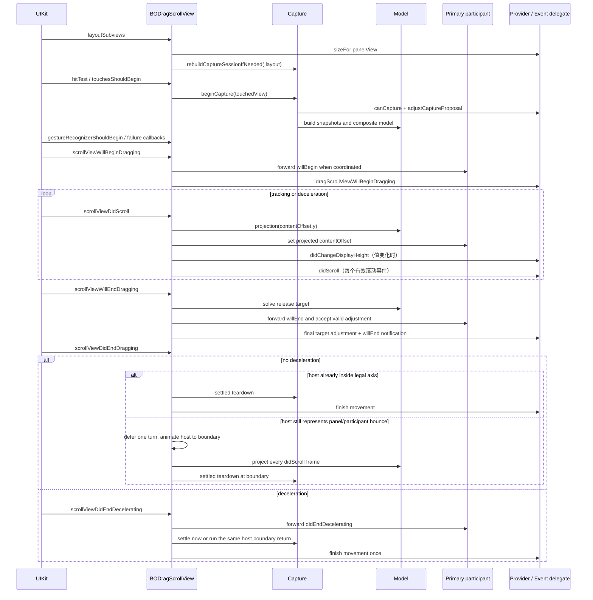

# BODragScroll UIKit 交互生命周期

本文按 UIKit 实际回调顺序说明当前 Swift 实现如何完成布局、触摸捕获、手势仲裁、拖动、释放、减速、动画、辅助功能和清理。数学映射另见 [`SCROLL_MODEL.md`](SCROLL_MODEL.md)。

主要代码边界：

| 文件 | 生命周期职责 |
| --- | --- |
| [`BODragScrollView.swift`](../Sources/BODragScroll/BODragScrollView.swift) | 初始化、公开状态、面板布局、几何原子更新 |
| [`BODragScrollInteraction.swift`](../Sources/BODragScroll/BODragScrollInteraction.swift) | hit-test、触摸时机补完、手势冲突、Web/UIControl、accessibility |
| [`BODragScrollCapture.swift`](../Sources/BODragScroll/BODragScrollCapture.swift) | responder-chain 捕获、会话所有权、KVO、模型重建与清理 |
| [`BODragScrollScrolling.swift`](../Sources/BODragScroll/BODragScrollScrolling.swift) | 高频 `scrollViewDidScroll` 投影和回弹归属 |
| [`BODragScrollTransition.swift`](../Sources/BODragScroll/BODragScrollTransition.swift) | 拖动/减速回调配对、释放目标、移动 transaction 和动画完成 |
| [`BODragScrollUIScrollViewBridge.swift`](../Sources/BODragScroll/BODragScrollUIScrollViewBridge.swift) | `UIScrollView` 状态 getter 兼容桥、capture lease、层级身份 |
| [`BODragScrollDiagnostics.swift`](../Sources/BODragScroll/BODragScrollDiagnostics.swift) | DEBUG-only 观察事件；只报告已经作出的决定 |

所有 UIKit 状态机代码都运行在 `@MainActor`。

## 1. 总体时序



这是主路径。布局变化、同步 client 回调、新 movement、window 移除和触摸中断都可能提前替换当前意图，因此实现处处使用 session/transaction/epoch 身份检查，而不是假设一次方法调用能不受重入地执行到底。

## 2. 运行时状态由谁拥有

`BODragScrollRuntimeState` 把内部状态按责任分组：

| 状态组 | 关键内容 |
| --- | --- |
| `panel` | 上次 bounds、是否完成首轮布局、待布局高度、面板替换 generation |
| `capture` | 当前 capture session、session/ownership 序号、操作 epoch、lease 清理 |
| `drag` | 最近一次运动来源：panel 或 participant |
| `scrolling` | offset mismatch 方向、恢复状态、didScroll callback epoch、当前 overscroll 边/owner |
| `transition` | movement transaction、当前 driver、拖动/减速配对、布局中断、动画监控 |
| `interaction` | 触摸补完 recognizer、延迟 UIControl、Web 命中状态 |
| `debug` | DEBUG-only sink 和触摸序号 |

另外有两个全局防护概念：

- `mutationDepth`：外层几何正在原子写入时抑制引擎自己的递归 `didScroll`。
- `decisionGeometryRevision`：公开几何或策略改变时使旧决策 token 失效。

## 3. 初始化与 UIScrollView 不变量

`commonInit()` 完成：

1. 永久安装 `UIScrollView.isDragging/isTracking/isDecelerating` getter bridge。
2. 将继承的 `delegate` 固定为 `self`。
3. 设置 `.never` 的 inset adjustment、`.fast` 减速、关闭 host 指示器和 `scrollsToTop`。
4. 允许取消 content touch，不延迟 content touch。
5. 安装 `TouchCompletionGestureRecognizer`。

外部不能把继承的 `delegate` 换成业务对象：

- 设置 `nil` 被忽略，以兼容通用 teardown 代码和 UIKit 析构过程。
- 设置其它对象在 Debug 触发 assertion。
- 同步决策使用 `behaviorProvider`，事件通知使用 `eventDelegate`。

这保证所有 `UIScrollViewDelegate` 生命周期都先经过组件自己的状态机。

## 4. 布局生命周期

### 4.1 `layoutSubviews`

每次布局记录旧 bounds。若 viewport 尺寸变化且已有有效布局：

1. 从 presentation layer 读取屏幕上正在显示的 outer offset 和 panel origin。
2. 按旧 viewport 计算当前真实可见高度。
3. 标记 transition 布局失效；若有旧 movement 或待结束减速，则摘下其 active driver，把 transaction、capture cleanup ownership 和待补齐的减速生命周期登记为 pending layout interruption。
4. 保存该展示高度供新布局恢复。
5. 若 UIKit 正在减速，立即停止旧减速。

旧 transaction 此时尚不发送 completion。只有新布局形成一套一致几何后，才以真实读回高度完成
`.interrupted`；从冻结开始到完成结束之间发起的新 movement 会进入有序队列，保证旧 completion
先于新 movement 开始。

随后在首次布局、尺寸变化或 `invalidatePanelLayout()` 请求下执行 `layoutPanel(previousBounds:)`。

### 4.2 面板尺寸和初始高度

展示高度的优先来源是：

1. 首次布局前的非动画 movement 请求；
2. 尺寸变化前保存的 presentation 高度；
3. 首次布局的 `effectiveMinimumDisplayHeight`；
4. 旧 frame 与 offset 推导出的当前高度。

然后同步询问：

```swift
behaviorProvider.dragScrollView(
    self,
    sizeFor: panelView,
    firstLayout: firstLayout,
    proposedDisplayHeight: &proposedDisplayHeight
)
```

尺寸无效时先用 `sizeThatFits`，仍无效则回退 viewport 宽高。provider 回调后会核对 panel replacement generation、provider 身份和 pending transaction，避免把旧回调结果应用到新面板。

### 4.3 基础 panel-only 几何

布局先安装一致的基础状态：

```text
panelOriginY = panelView.frame.minY = 0
outer contentSize.height = panelView.frame.height
outer contentOffset.y = proposedDisplayHeight - bounds.height
```

外层 inset 由最小/最大配置展示高度得到。完成基础几何后：

1. 标记 panel layout ready。
2. 取走当前 pending movement；只有进入本轮时记录的 transaction ID 精确匹配者才可标记为“已由本轮基础几何应用”，ID 不匹配的新请求会标记为未应用并在布局后正常执行。
3. 记录 `nextTransactionID` 作为本轮 layout movement epoch。
4. 以 `.layout` 原因重建已有 capture session 的组合模型并提交一致几何；该 rebuild 不自行发布中间高度，最终回读与发布由外层 layout pass 统一拥有。
5. participant offset 始终最后写，且 setter 可能同步触发新 movement。layout 通过 panel generation 和 transaction epoch 判断自己在回调返回后是否仍拥有发布权。
6. 若仍拥有发布权，layout 回读一次真实几何，并用 `ProjectedHeight.authoritative(proposedDisplayHeight).publishedValue` 处理严格小于 `0.0001pt` 的算术尾差；若更新的 transaction 仍在运行则跳过旧发布。整个过程不进行第二次 frame 写入。
7. 完成尺寸变化导致的 pending layout interruption。
8. 执行第 2 步取走的 pending movement；provider 或其它回调中新建的请求不冒充本轮已应用意图。

### 4.4 `invalidatePanelLayout()`

当安全区或业务 sizing 输入变化、但 host bounds 没变时，公开方法 `invalidatePanelLayout()` 走与尺寸变化相同的中断/保高路径。它不会要求替换 `panelView`。

## 5. 命中测试

### 5.1 可见区域

`point(inside:with:)` 和 `hitTest(_:with:)` 都使用 `panelView.layer.presentation()`；因此 UIView 动画期间的可点击区域跟随屏幕上的面板，而不是提前跳到 model layer 终点。

命中范围仅是 panel 自己实际可见且可响应的区域。没有 panel、隐藏、禁用交互或 alpha 过低时返回 nil。

### 5.2 惯性期间选择谁接收中断触摸

若 host 正在 view transition、system-scroll transition 或原生减速：

- 最近一次运动来自 participant：触摸落在主参与者深层内容时，返回命中路径上最近的嵌套 scroll view；找不到则返回主参与者。这样中断惯性不会误触下面的 control 或 Web 内容。
- 最近一次运动来自 panel：只读扫描本次命中链，返回首选内部 scroll view；没有则返回 host 自己。

如果 host 没在减速，但命中链上某个嵌套 scroll view 独立减速，hit-test 先返回那个 scroll view，让 UIKit 先停止它的惯性。

## 6. 手指按下与响应链捕获

### 6.1 `touchesShouldBegin`

组件在调用 `super.touchesShouldBegin` 前执行 `interaction_touchesShouldBegin`：

1. DEBUG 模式记录触摸开始。
2. 必要时补发 UIControl `.touchDown`。
3. 从 UIKit 给出的最深 `view` 调用 `beginCapture(from:)`。
4. 保存本次是否命中 WKWebView。
5. DEBUG 模式在决策完成后报告 capture/model；日志不参与选择。

### 6.2 responder-chain 扫描

`scanCandidates` 从最深命中 responder 向 `BODragScrollView` 方向遍历。只把启用的 `UIScrollView` 放进候选列表，同时记录：

- responder 深度；
- 使用 `adjustedContentInset` 判断的纵向/横向可滚性；
- provider 的 `canCapture` 结果；
- 是否经过 `WKWebView`。

默认主候选是最内层第一个纵向可滚 scroll view。若没有，则使用 frame 高度最大的可捕获 fallback。纯横向候选默认保留给 UIKit，不自动成为联动参与者。

### 6.3 proposal 决策

只要没有因为离屏/捕获暂停或 Web 禁用策略提前退出，扫描后就会调用 `adjustCaptureProposal`，包括 0、1 或多个候选，以及 WKWebView 内只有一个候选的情况。provider 可以：

- 把 `primaryCandidateID` 改成另一个已扫描且可捕获的候选；
- 设为 nil 拒绝捕获；
- 调整每个候选的 `BODragScrollCapturePriority`。

主候选最终强制标为 `.participant`。位于主候选外侧、纵向可滚且同样为 `.participant` 的祖先按 responder 顺序加入 `participantChain`。

provider 是任意同步业务代码。返回后引擎会不再询问策略地重新扫描一次，要求物理候选链和 Web 身份没有变化；否则放弃旧操作。

### 6.4 Web 边界

- `disablesPanelInteractionInWebView == true`：命中 Web 时结束 capture，之后 host pan 的 shouldBegin 返回 false。
- `ignoresMultipleNestedWebScrollViews == true`：从主候选到 Web 容器若发现至少两个纵向 scroll layer，结束 capture，让 Web/UIKit 自己处理。
- 非主手势的 simultaneous 规则不会与主参与者下面的 recognizer 共存，避免 Web 内两层同时滚动。

若旧减速/回弹仍拥有 capture，Web 禁用、拒绝捕获或其它不兼容结果不会在 touch-down 当场拆掉
旧拓扑或轴阶段；引擎只保存 touched view。真实 host drag 开始后才应用该结果，tap-only 则由旧轴完成结算。

### 6.5 capture session 和独占 lease

安装 session 前会创建 `BODragScrollCaptureHierarchySnapshot`，弱持有并记录：

- host、panel 和参与者身份；
- 从主参与者到 panel 的每一条精确 superview 边。

仅仅“仍是 descendant”不够；插入 wrapper/scroll ancestor 或 reparent 都会让旧快照失效。

同一物理 scroll view 同时只能被一个有效 session 租用。lease 会：

- 保存并暂时关闭原 `scrollsToTop`；
- 拒绝另一个仍有效 host 的抢占；
- 回收层级已失效的孤儿 lease；
- 在释放时恢复原值。

同一条链再次捕获时优先复用 session 并刷新 `ownershipGeneration`。平稳状态会重建模型；若触摸正在
接管旧减速/回弹 driver，则先保留当前轴阶段，避免在 tracking 阶段把临时 bounce offset 误解释为新的
数学起点。只有触摸真正进入 drag、旧 driver 已被中断后，符合连续自由面板条件的轴阶段才可能在合法
边界上重基。
平稳状态下链变化会完整 teardown 旧 session，再创建从 1 开始的稳定 `ParticipantID`；物理 owner
活动时命中 sibling chain，则保持旧 session 到真实 `willBeginDragging`，再 fresh 为新链。多指 drag
同样固定首指已建立的轴。

## 7. Capture 重建与轴阶段重基

`rebuildCaptureSessionIfNeeded` 的 reason 包括：

- `.initialCapture`：按下建立或刷新 capture；
- `.layout`：panel/viewport 重新布局；
- `.observedMetrics`：参与者 `contentSize/contentInset/adjustedContentInset` 变化；
- `.mismatchRecovery`：拖动进入可恢复方向；
- `.explicitReload`：外部调用 `reloadScrollMetrics()`；
- `.configuration`：detent、configuration 或 behavior provider 改变后刷新决策几何。

每个参与者使用 KVO 观察上述 metrics，回到主队列后核对 session ID、participant ID、对象身份和 `isInternallyMutating`，再触发重建。

tracking、减速、回弹或其它 active driver 正在使用捕获时 metrics 快照时，KVO 不立即重建：session 只记录一次 deferred-metrics 标记，当前物理生命周期继续使用该快照。若 UIKit 因 `contentSize` 收缩已先行夹回 participant offset，KVO 只用当前已提交轴阶段和未变的 host offset 恢复这个发生变化的 participant，不改写 host 或其它参与者，也不启动新动画。终止清理按变化后的 standalone range 使用 `forced` 语义。旧物理 owner 尚未结束时发生的新 touch-down 仍保留旧轴；只有它实际进入 `willBeginDragging`，才先中断旧 driver，再从当前 metrics 建立 fresh session。仅 tracking 后抬起不会把旧轴替换掉。这样动态列表加载/收缩不会把临时 bounce offset 折叠成新的组合轴起点。

平稳状态下，`reloadScrollMetrics()` 先更新 panel-only outer inset 并保持当前 offset，再重建当前 capture；若外部在当前物理生命周期中调用，它与 metrics KVO 一样只标记 deferred，不改写正在使用的轴。

configuration、detent 和 behavior provider 变化使用独立的 `.configuration` 路径：新的配置对象、provider 和 decision revision 立即生效，但依赖它们的组合轴、inset 和 provider panel sizing 在当前物理 owner 结束前不折入旧模型。provider 变化还会暂缓普通 `layoutSubviews` 对 panel 的重算；capture teardown 后统一安排一次布局。viewport 尺寸或显式 `invalidatePanelLayout()` 属于结构性变化，会通过既有 coherent-layout interruption 立即取得所有权，不受这项延迟限制。配置变化只延迟几何，不需要额外 dirty 状态，也不把正常 settled teardown 升级为 forced。

### 7.1 连续自由面板的轴阶段重基

重基不是 capture rebuild。它保留 session ID、ownership generation、参与链、层级快照、lease、KVO 和
捕获时 metrics，只用纯模型把所有 participant segments 的激活高度平移到一个新的合法语义枢轴。
因此 capture 拓扑在整个物理生命周期内稳定，而组合轴模型只要求在一个单调运动阶段内不可变。

只有同时满足以下条件的轴阶段才标记为可自适应：

- `detentHeights` 为空，面板高度连续；
- handoff 为 `.coordinated`；
- 参与段来自组件自动建段，而不是 behavior provider 的有效显式片段；
- placement 为 `.automatic` 或 `.fromTouchedPosition`；
- 参与段总长度大于零。

资格保存为 `.continuousPanel`；当时真实 host offset 端点及其精确合法展示高度成对保存在 axis phase 中。
后续配置/provider 变化不能重新解释旧阶段；mismatch recovery 继承原重基策略，但 endpoint authority
必须由本次实际写入的 inset/contentSize 重新成对生成，不能把旧高度配给新边界。

存在 detent、`.atDisplayHeight`、`.afterPanelFullyDisplayed`、有效显式片段、`.innerFirst`、
`.innerFirstAtBoundary` 都是固定轴。session 处于 deferred metrics、offset mismatch、层级/lease 失效，
或当前 UIKit participant offsets 与旧模型投影不一致时也 fail closed，不重基。

重基只有两个入口：

1. **同一次真实拖拽反向返回。** 最近一次已提交的 canonical host offset 已经位于旧参与段外至少一个
   物理像素，本次真实 `isDragging` 位移又朝参与段返回时触发。旧模型本身已表达“位于参与段上方还是
   下方”，无需维护额外方向状态。tracking-only 触摸和旧减速尾帧不会触发。
2. **新真实 drag 接管减速/回弹。** `willBeginDragging` 已中断旧 driver 后，若当前合法 canonical
   位置已经离开旧参与段至少一个物理像素，按当前位置重基；touch-down 和仅 tracking 阶段不做任何改变。

“至少一个物理像素”只确认面板确实离开旧参与段：差值严格小于一个物理像素仍视为边界抖动，恰好
一个像素已经可以触发。比较只接纳阈值相邻一个 ULP 的机器表示噪声，不引入普通误差带；它不放宽
模型相等、终点或公开高度精度。

执行时先把参考 host offset 钳到 axis phase 保存的合法 outer offset 范围。中间位置从旧模型
投影取得合法枢轴高度；若命中 host 最小/最大端点，则直接使用 endpoint authority 的精确下/
上端点，组合轴反算尾差不会进入新模型。随后以相同 viewport、participant 顺序和 inner ranges 构建
候选。raw overscroll 保持不变；它只参与新旧投影的 bounce 连续性验证，不成为激活高度。候选提交前
必须确认：

- 参考点的新旧 `panelOriginY`/display height 一致；
- 每个 participant 的 ID、offset 和顺序一致，且真实 UIKit offsets 仍匹配旧投影；
- overscroll edge、owner、boundary 和 distance 一致；
- session、operation epoch、层级和 lease 仍属于当前调用。

验证成功后只原子替换轴阶段并推进 operation epoch；不写 `contentOffset`/frame/inset，不调用 provider、
participant delegate 或 event delegate，也不更换 capture generation。随后当前这一次普通 `didScroll`
用新模型投影实际 delta，使返回方向优先在当前高度消费内部范围，耗尽后才继续移动面板。

普通 `didScroll` 只读取最近样本、参与段首尾和当前 delta，门控为 O(1)；只有命中上述语义拐点才按
participant segments 数量执行 O(n) 的纯模型重建和连续性验证。重基不是逐帧行为。

### 7.2 handoff mode

- `.coordinated`：构建组合模型，由 host pan 驱动 panel 和 participants。
- `.innerFirst`：capture 身份可以存在，但组合模型被停用，内部原生 pan 负责。
- `.innerFirstAtBoundary`：重建时若主参与者正处于原生减速，会停用组合模型；平稳状态可以保留预建模型。真正由谁响应本次手势，仍在 shouldBegin 阶段用实际手势速度和内部边界决定。

无法构建有效 participant segment 时也停用组合模型并恢复 panel-only 几何。

## 8. 手势开始和冲突优先级

### 8.1 `gestureRecognizerShouldBegin`

对 host pan：

| 模式/状态 | 结果 |
| --- | --- |
| `.coordinated` | 允许 host pan |
| `.innerFirst` 且存在主参与者 | 拒绝 host pan |
| `.innerFirstAtBoundary`，内部还能沿速度方向滚 | 拒绝 host pan |
| `.innerFirstAtBoundary`，内部已到对应边界 | 允许 host pan |
| Web 禁止 panel 交互且本次命中 Web | 拒绝 host pan |

### 8.2 与主参与者 pan 的固定关系

主参与者不走 provider 的通用 gesture strategy：

| handoff | 失败关系语义 | simultaneous |
| --- | --- | --- |
| `.coordinated` | host pan 优先，内部 pan 等待 | false |
| `.innerFirst` | 内部 pan 优先，host pan 等待 | false |
| `.innerFirstAtBoundary` | 内部可消费时内部优先；不能消费时 host 优先 | false |

组合模式并不是两个 scroll view 同时原生滚动；只有 host 作为 driver，内部 offset 由模型写入。

### 8.3 与其它手势

非主手势先询问 `behaviorProvider.strategyFor`：

- `.panelFirst`：让其它 recognizer 等待 host。
- `.otherFirst`：host 等待其它 recognizer。
- `.simultaneous`：同时识别。
- `.systemDefault` 或 nil：继续使用 capture priority 和配置。

捕获 priority 的语义与枚举名一致：`.panelFirst`、`.otherFirst`、`.simultaneous`、`.systemDefault`；`.participant` 对非主祖先按 panel 优先处理。

Touch-completion recognizer 始终允许 simultaneous。减速期间的 tap 是否失败由 `failsOtherTapDuringDeceleration` 控制，同时保留“participant 区间内、participant 外部 tap”用于停止惯性的特殊共存路径。

## 9. `scrollViewWillBeginDragging`

真实 host drag 开始时，Transition 层按顺序：

1. 标记 user-drag 生命周期活动；此阶段请求的程序化 movement 延迟到 did-end 之后。
2. 若上一次 UIKit 减速没有交付终止回调，先补齐 participant 和 event delegate 的 `didEndDecelerating`。
3. 取消 touch-completion fallback。
4. 中断当前程序化/动画 movement。
5. 在旧减速补完和旧 movement completion 之后分别复核 window、panel 身份与 replacement generation；回调若已换掉层级，本次 begin 立即停止。
6. dirty、不同 sibling chain 等待处理时建立 fresh session；否则对符合条件的连续自由轴执行一次无回调重基检查。
7. 记录本次 drag 拥有的 capture session/generation，用于终止时只清理自己的 session。
8. 只有当前模型含 participant segments 时，才把完整 drag 生命周期绑定并转发给主参与者。
9. 依次调用主参与者 delegate `scrollViewWillBeginDragging`、组件 `eventDelegate`，并在每个外部回调边界后复核层级；若中途失效，只为已经发送的 begin 补齐对应 end。

`touchesShouldBegin` 通常已为新触摸建立或刷新模型，`willBeginDragging` 不再无条件 reload。旧物理轴
仍被上一轮减速/回弹拥有时，dirty 模型、不同 sibling chain 或拒绝捕获等不兼容结果都只记录待捕获
视图；真实 drag 开始时先中断旧 driver，再显式建立 fresh session。同一手势中的同链 capture refresh
会更新 cleanup ownership；异步 settlement 只沿同一 session 已转移的新 generation 继续。终止回调中
重新建立但未转移 ownership 的 capture 不会被旧 drag 清理。

## 10. `scrollViewDidScroll` 高频路径

每次 host offset 变化：

1. 忽略内部原子写入产生的回调。
2. 增加 `callbackEpoch`，验证 capture 层级。
3. 遇到非有限 offset 时恢复为有限坐标并停止本次处理。
4. 若存在 offset mismatch 且手势正在朝可恢复方向移动，强制按当前位置重建模型。
5. session clean 且当前为真实 drag 时，以 O(1) 条件检查连续自由轴是否从参与段外反向返回；命中后先完成纯模型重基。
6. 有组合模型时对 `contentOffset.y` 做纯投影；无模型时只处理 panel bounce。
7. `resolveScrollGeometry` 把投影与 bounce 策略解析成临时 `ResolvedScrollGeometry`，其中包含唯一的 `panelOriginY`、`ProjectedHeight`、host 修正和最终 participant offsets。
8. `commitResolvedScrollGeometry` 在一次受保护提交中写 host 修正与 panel frame，panel 最多写一次；participant offsets 在保护范围外最后写，并在每次 callback-bearing setter 前后复核所有权。
9. commit 成功后回读 UIKit 实际展示高度，再由 `ProjectedHeight.publishedValue` 决定本轮公开值；随后更新 overscroll、滚动速率与轴阶段采样，并发布 `displayHeight` 和 `didScroll`。

协调引擎不会调用参与者的 `flashScrollIndicators()`，也不会寻找或修改 UIKit 私有指示器
子视图。这是滚动几何的所有权边界：引擎只投影 panel 与参与者 offset，参与者自身的原生
指示器由业务配置和 UIKit 管理；联动专用提示应作为独立 overlay 消费滚动事件实现。

引擎自身原子写入产生的递归 delegate 回调会被 ownership guard 忽略；除此之外，每次
正常进入该路径的系统 `didScroll` 都发布一次组件 `didScroll`，不使用数值或物理像素
阈值过滤次数。`.geometric` 高度如实保存 UIKit 回读值；`.authoritative` 只在严格小于
`0.0001pt` 时把算术尾差收拢到模型标准值。只有 `didChangeDisplayHeight` 相对上次通知基线
做严格数值去重，连续微小变化可以累计后触发。

每次参与者 offset 写入都可能同步调用业务 delegate，甚至触发新 movement、换 panel 或 reparent。因此写入前后反复核对：

- capture session 对象；
- capture operation epoch；
- scrolling callback epoch；
- panel 身份；
- 精确层级快照。

旧调用一旦失去所有权立即返回，不会继续覆盖新状态。

## 11. 手指抬起：目标解析顺序

`scrollViewWillEndDragging` 从 UIKit 给出的预测 target 开始：

1. 只读使用当前已经原子提交的 active axis phase model；没有 capture 但有 detent 时构建 panel-only anchors 模型。
2. 不在 release 决策中重建模型或改写 inset/frame/participant offset；bounce/deceleration 的临时几何不能成为新模型输入。
3. 调用纯 `TargetSolver`。无 detent 或无可用模型时保留系统预测。
4. 将 `scrollViewWillEndDragging` 转发给本次绑定的主参与者 delegate；只接受仍在主参与者同一 segment 内的有限调整。
5. 调用 `behaviorProvider.adjustTargetContentOffset` 做最后同步调整。
6. 若 target 未被外部精确修改且精确落在模型端点，采用该端点的标准高度；其余 target 按真实 offset 投影。
7. 写回 UIKit 的 `targetContentOffset`。
8. 通知 `eventDelegate.dragScrollViewWillEndDragging`。

任一步同步回调若启动新 transaction 或改变决策几何，旧释放目标会被取消，UIKit target 改回当前 offset，防止旧减速和新 movement 同时运行。

每次有效 `scrollViewWillEndDragging` 都创建 reason 为 `.dragRelease` 的 transaction，并
发送一次 `willMoveToDisplayHeight`，即使目标展示高度与当前相同。释放目标是事件/意图，
不是 value-changed 通知；是否需要系统减速，使用真实 target offset 与当前 offset 的精确
`!=` 判断。

### 11.1 何时用 view animation 替换系统减速

只有以下条件同时成立才可能替换：

- 释放分类是 panel -> panel；
- target 与当前 offset 不同；
- 路径没有穿过任何 participant segment，包括零长度 anchor；
- provider/config 最终选择 `.viewAnimation`。

替换时先把 UIKit target 改回当前 offset并停止系统减速，再安装 UIView animation。涉及 participant 的路径继续使用系统滚动，保证组合轴逐点投影。

## 12. did-end 与减速结束

### 12.1 `scrollViewDidEndDragging`

该回调以 UIKit 实际给出的 `willDecelerate` 校正原生 driver；若 `willEnd` 已明确换成组件自己的 UIView/system animation，则保留该动画 owner，不让一个陈旧的 UIKit 布尔值抢回所有权。随后：

1. 将回调转发给绑定的主参与者 delegate。
2. 通知组件 event delegate。
3. 完成可能由惯性中断触发的 UIControl 序列。
4. 若不减速且 host 已在合法轴内，以 `settled` 方式结束本次 drag 真正拥有的 capture，并完成 release transaction。
5. 若不减速但 host 仍表示 panel/participant bounce，保留 capture 和 transaction；终止回调退出后的下一主队列 turn 让 host `UIScrollView` 动画回边界，participant 只通过普通 `didScroll` 投影逐帧移动。
6. 若要减速，保留 capture/model 和 participant lifecycle，等待终止回调。
7. 方法退出时开放拖动期间延迟的程序化 movement。

### 12.2 `scrollViewDidEndDecelerating`

仅在确实等待减速结束且 host 已不再 decelerating 时接受。UIKit 可能在新手指已经 tracking、但尚未形成新 drag 时交付旧减速唯一一次终止回调；此时先配对生命周期通知，但延后 capture/transaction 清理，直到 tracking 结束或新 drag 正式接管。

1. 转发主参与者 `scrollViewDidEndDecelerating`。
2. 通知组件 event delegate。
3. tracking 已结束且已归边时 settled teardown；若仍 tracking，或 UIKit 报告减速结束后 host 仍越界，则进入统一的异步 settlement。
4. settlement 等待 host 退出 tracking/decelerating；有越界时由 host 的系统滚动回到标准边界，真实稳定后才完成 `.dragDeceleration` transaction。

UIKit 在取消/中断手势时可能省略 `willEndDragging`，此时存在原生 `.dragDeceleration` driver，但没有 movement transaction。driver 及其 monitor keys 由独立的原子清理方法释放，不依赖 transaction。若该终止回调恰好落在新手指的 tracking 阶段，先清旧 driver、保留刷新后的 capture；新手指形成 drag 时直接接管，只是短按则在抬起后按 capture generation 安全释放。

减速/回弹中出现新触摸时：

- 同一捕获链且模型未 dirty 时复用 session，递增 ownership generation，保留屏幕上正在使用的轴阶段；真实进入 `willBeginDragging` 并中断旧 transaction 后，连续自由轴才可在合法枢轴重基；模型 dirty 时 touch-down 仍不换轴，实际 drag 才在中断旧 driver 后建立 fresh session；
- 命中不同 sibling chain 或本次策略拒绝捕获时同样只保存 touched view；真实 drag 后才换轴，tap-only 和 active drag 的额外手指都不会中途替换首指模型；
- 仅 tracking、最终没有形成 drag 的短触摸不会丢失旧回弹，tracking 结束后原 boundary return 继续；
- 已捕获层级本身失效、panel/window 失效时强制关闭旧 owner；
- 迟到的旧 `didEndDecelerating`、动画结束回调或 settlement sample 必须同时通过 transaction、driver、session ID 和 generation 校验，否则没有清理权限。

新触摸或程序化 movement 可以在 UIKit 漏掉终止回调时主动关闭旧减速生命周期，但每一组实际发送过的 participant/event begin 都最多配对一次 end。

## 13. 系统动画、UIView 动画与 transaction

每个被接受的 movement 请求有一个 `BODragScrollMovementTransaction`：

- 独立 ID；
- requested 和 resolved 展示高度；
- reason；
- completion-once 结果。

新 movement 会以 `.interrupted` 结束旧 transaction。非法、非有限或缺少 panel 的请求以 `.cancelled` 完成。

### 13.1 延迟执行边界

movement 在以下窗口不会立刻重入：

- 从布局中断被冻结开始，直到旧 transaction、capture cleanup 和被取消的减速生命周期全部完成；
- user drag 同步生命周期尚未结束；
- host 正处在 `withInternalMutation` 的部分几何状态。

请求被有序排队，在对应原子阶段结束后执行。

### 13.2 程序化移动

`move(toDisplayHeight:)` 是 panel-only 绝对语义：

1. 暂停新的 capture acquisition。
2. 结束当前 capture，移除 participant 距离。
3. 刷新 panel-only metrics。
4. 以 `requestedDisplayHeight - bounds.height` 计算绝对 target。
5. 根据禁止的 panel bounce 侧钳制。
6. 选择 `.systemScroll` 或 `.viewAnimation`。

首次有效布局前的请求保存在 pending layout movement 中。非动画请求可由首次布局直接应用，但仍
经过与正常移动相同的顶部/底部 bounce 限制；钳制后使用语义上的
`effectiveMinimumDisplayHeight` / `maximumConfiguredDisplayHeight`，不从 offset 反算目标。
由首次布局直接应用的非动画请求会在写几何前发送 `willMoveToDisplayHeight`；同步回调若创建新意图，
旧 layout pass 放弃并重来。animated pre-layout 请求要等布局有效后进入正常 `executeMovement` 才发布目标。
每个 layout pass 只消费进入本轮时记录的 transaction ID。

若屏幕上的 system-scroll 请求的 target offset 与当前 offset 精确相同，UIKit 不会产生自然滚动
回调。此时自然/system-style 路径保持现有几何，只回读实际高度；若它与已知目标严格相差小于
`0.0001pt`，仅将公开值收拢到该目标。非动画、off-window 和 `.viewAnimation` 的同 offset 请求
继续采用各自已有的实际结果。所有路径都不追加几何修正。

### 13.3 完成监控

系统滚动和 scroll-to-top 不依赖单个 UIKit completion callback；Transition 层记录 transaction ID、
driver、目标、起点和是否观察到真实进度，并持续采样 settlement，防止漏回调或陈旧回调完成后来
的 movement。`scrollViewDidEndScrollingAnimation` 没有动画标识：只有当前 driver 仍是
`.systemAnimation` 且 transaction ID 与该 driver 的记录一致时，它才能更新时间提示并唤醒当前监控；
其他回调只按 UIScrollViewDelegate 的事件语义向外转发，对内部状态没有影响。即使匹配，该回调也
不能单独证明动画已经结束。

settlement 监控只根据 transaction 身份、真实 `contentOffset`、scroll callback epoch 和
UIKit 稳定状态判定 completed/interrupted；正常动画完成不会再修正 offset/frame，也不生成另一份
presentation `displayHeight`。极少数情况下 UIKit 在旧 tracking 回调栈退出时拒绝启动已请求的
`setContentOffset(animated:)`；连续 12 个稳定采样都没有任何进度或结束回调后，引擎仅把同一个已解析
host target 非动画写入一次，仍走普通 `didScroll` 投影，防止 transaction/capture 永久悬挂。当前实现
没有 CADisplayLink 或第二套几何动画。

UIView animation 会去掉 `.repeat` 和 `.autoreverse`，因为这两种选项没有稳定终态，无法保证
transaction 完成一次。它的完成和中断都直接按自己的 transaction、现有模型和真实几何结算，不调用
metrics reload；新拖动中断一次纯 panel-to-panel 动画也不会被误标记成 participant metrics dirty。
若 animation completion 到来时新手指仍在 tracking/decelerating，transaction 和几何仍立即结算，只把
同 session 的 capture teardown 延迟到抬手；真实 drag 可直接接管该 capture，不会退化为 panel-only。

## 14. 系统时机补完 recognizer

`TouchCompletionGestureRecognizer` 不是 `UITapGestureRecognizer`。它解决的情况是：

1. 一次触摸中断了系统滚动动画；
2. UIKit 刚为当前仍被组件持有的 system-animation driver 交付
   `scrollViewDidEndScrollingAnimation`；
3. 这次触摸没有继续成为真实拖动；
4. 手指随后抬起。

若动画结束时间距 shouldBegin 小于 0.1 秒，recognizer 接管这个 completion 时机；结束时调用
`settleToNearestDetent`。driver 被完成、中断或替换时会与其监控键一起清除此时间戳，旧动画不能影响
新触摸。如果真实 `scrollViewWillBeginDragging` 到来，立即取消 fallback，避免重复吸附。

recognizer 不取消 view touches，支持多指并等到所有手指结束。

## 15. UIControl 特殊行为

当 participant 惯性被 panel 内、但主参与者外部的 `UIControl` 触摸中断时，`UIScrollView` 可能吞掉 control 的正常序列。组件会：

1. 在 `touchesShouldBegin` 手动发送 `.touchDown`。
2. 保存弱引用，不阻止 control 释放。
3. 在外层 `scrollViewDidEndDragging` 根据手指最终是否仍在 control bounds 内发送 `.touchUpInside` 或 `.touchUpOutside`。

深层 participant 内容中的 control 在惯性中断时不会误触，因为 hit-test 会先把触摸交给最近 scroll view。

## 16. Accessibility 和 scroll-to-top

### 16.1 `accessibilityScroll`

先询问 provider disposition：

- `.handled`：业务已处理，组件直接返回 true。
- `.panelOnly`：不检查内部参与者，只执行面板语义。
- `.automatic`：必要时检查或临时捕获内部参与者。

当前实现中：

- `.down` 优先移动到更高 detent；无 detent 且没有应保留给内部的参与者时，移动到 panel 最大边界。
- `.up` 优先移动到更低 detent；位于最大 detent 且内部仍有向上可访问内容时返回 false，让内部处理；无 detent时可移动到 panel 最小边界。

accessibility movement 使用普通 transaction，reason 为 `.accessibility`，因此同样能正确中断 participant 减速或活动动画。

### 16.2 `scrollsToTop`

host 自己保持 `scrollsToTop = false`，但实现 `scrollViewShouldScrollToTop` 作为内部 transition 入口：

1. provider 可拒绝。
2. 新 transaction 接管并关闭旧减速生命周期。
3. 刷新最终轴后，以 `minimumOuterOffset` 为目标。
4. 已在目标且没有 presentation 动画时同步完成。
5. 否则进入 `.scrollToTop` driver，只用该 transaction 持有期间观察到的真实目标和进度采样结算。

`scrollViewDidScrollToTop` 没有请求标识，可能属于已经被替换的旧请求，因此只保留系统事件的对外
转发语义，不作为内部完成证据。若 UIKit 授权后始终未启动，连续 12 个稳定采样均无进度时，组件将
同一个已解析 target 非动画写入一次，再由普通 `didScroll` 投影和目标采样结算，避免 transaction 与
capture 永久悬挂。

参与者的原 `scrollsToTop` 值由 capture lease 保存并在清理时恢复。

## 17. 刷新、失效和清理

### 17.1 `endCapture()` 的顺序

清理会先增加 operation epoch，使旧异步/同步栈失效，然后：

1. 保存当前展示高度。
2. 将 `runtime.capture.session` 和 session 的当前轴阶段清空。
3. 解除主参与者状态 getter 绑定。
4. 在任何 callback-bearing participant/`scrollsToTop` 写入之前，先原子恢复完整 panel-only 几何。
5. 失效所有 KVO observation。
6. 在 session 仍拥有 lease、层级有效且确实建立过组合模型时按 teardown disposition 处理 participant：正常 `settled` 只把严格数值尾差归一到精确端点；结构/所有权被打断的 `forced` 才把真实越界值收回合法范围。
7. 释放每个参与者 lease 并恢复其原 `scrollsToTop`。
8. 最后重新发布当前 panel 展示高度。

“先恢复 host 一致几何，再触碰可能回调业务的 participant”是清理的关键不变量。业务永远不应观察到 session 已为 nil、但 host 仍保留 composite contentSize/`panelOriginY` 的半状态。

### 17.2 window 移除

`willMove(toWindow: nil)` 先设置持久 capture suspension，再：

- `endCapture()`；
- 中断活动 movement；
- 关闭未完成的 drag/deceleration 生命周期。

重新进入 window 时才解除 suspension。离屏期间不会新建生产 capture session。

### 17.3 替换 panel

替换 `panelView` 会增加 replacement generation、暂停 capture acquisition、中断旧 movement、结束 capture、停止减速、移除旧 panel，再安排新 panel 的首次布局。任何旧 completion 同步发起的新请求都会被排到新 panel，而不是继续操作旧几何。

### 17.4 host 析构兜底

`BODragScrollHostLeaseCleanup` 不依赖 host 仍能进入 MainActor 方法。若 UIKit 未先交付 window-removal 路径，它用不可变 host/session 身份清除仍属于旧 host 的 bridge/lease，必要时收回 participant offset，并恢复 `scrollsToTop`。若对象已被新 session 接管，则不覆盖新 owner。

## 18. UIScrollView 状态桥的边界

Swift 版保留源实现对主参与者三项状态的兼容：

- `isDragging`
- `isTracking`
- `isDecelerating`

bridge 是进程级永久 getter hook，只安装一次，不提供运行时卸载。它保存安装前的 next IMP，因此能与更早安装的 hook 串联。

只有当前 capture session 的主参与者绑定 host 状态；祖先参与者保持其原生状态。关联是弱引用，并同时验证 session ID 和精确层级快照。ABI 根据 Objective-C `BOOL` 的 `B`/`c` encoding 选择正确函数签名。

## 19. Client 回调与重入规则

### 19.1 provider

`behaviorProvider` 是同步决策源，可能在回调中：

- 发起 movement；
- 修改 detent/configuration；
- 替换 panel/provider；
- 修改或 reparent participant。

因此每次 provider 前后都会比较 transaction epoch、capture operation epoch 或完整 `decisionStateToken`。状态变化后，旧调用只能退出或 fail closed。

### 19.2 event delegate

`eventDelegate` 只通知，但仍允许同步发起新意图。旧 transaction/session 在每个事件后重新验证身份，不能假设“通知方法没有返回值就不会改变状态”。

- `didChangeDisplayHeight` 是值变化通知，可按严格数值语义去重。
- `didScroll` 是滚动事件，每个有效系统回调如实发布，不按高度去重。
- drag/deceleration 回调是 UIKit 生命周期事件，不做值去重。
- `willMoveToDisplayHeight` / `didFinishMovement` 是 transaction 事件，同高度目标仍可产生。

### 19.3 DEBUG diagnostics

`BODragScrollDiagnostics.swift` 仅在 `canImport(UIKit) && DEBUG` 下存在。它在触摸捕获和手势决定完成后发送结构化事件，或报告模型构建失败；sink 不进入任何条件判断，也不修改 capture priority、gesture strategy 或 target。

## 20. 生命周期修改时的检查清单

1. host 的 inherited delegate 是否仍由组件独占？
2. callback-bearing setter 前，host 是否已经处于完整一致状态？
3. provider/event/participant delegate 返回后，是否重新验证 transaction、session、epoch 和层级？
4. 新 drag、程序化 movement、布局变化和 window removal 是否都能成对关闭旧 deceleration lifecycle？
5. 清理是否只结束自己记录的 session/generation，而不误删回调中新建的 capture？
6. participant 生命周期是否始终绑定同一个主参与者，而不会因目标片段属于祖先而换对象？
7. didScroll 是否先完整 resolve，单次 commit 中 panel 最多写一次，再最后写 participant offset，并在成功后回读发布？
8. 无 detent 是否仍建立 coordinated participant model，但释放不吸附？
9. Web、UIControl、touch-completion 和 accessibility 的特殊系统时机是否仍各自只有一个 owner？
10. movement completion 和 `didFinishMovement` 是否对每个 transaction 最多执行一次？
11. 减速中同链新触摸、仅 tracking 的短触摸、迟到 terminal callback 是否都保持旧/新 ownership 隔离？
12. 正常 settled teardown 是否保留真实 bounce，forced teardown 是否只作用于自己仍持有 lease 的 generation？
13. 自适应重基是否只用于无 detent、自动 placement 的 clean coordinated session，并且没有重捕获、UIKit 写入或外部回调？
14. 同手势重基是否要求真实 `isDragging`、至少离开旧参与段一个物理像素，并在原子替换前验证新旧正常/bounce 投影连续？

UIKit 集成验证集中在 [`BODragScrollUIKitIntegrationTests.swift`](../Tests/BODragScrollTests/BODragScrollUIKitIntegrationTests.swift)，覆盖首次布局、重入、capture lease、嵌套投影、回弹、drag callback 配对、scroll-to-top、accessibility、window/析构清理和触摸补完。
