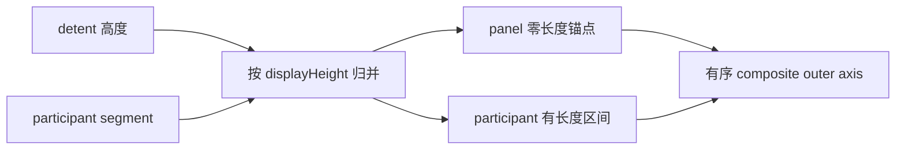
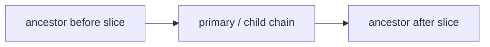

# BODragScroll 组合滚动轴数学模型

本文描述当前 Swift 实现实际使用的数学模型。重点是回答三个问题：面板高度和外层偏移如何对应；多个内部 `UIScrollView` 如何被拼成一条轴；手指释放后如何从 UIKit 的预测目标得到最终目标。

对应实现主要位于：

- [`Core/BODragScrollModel.swift`](../Sources/BODragScroll/Core/BODragScrollModel.swift)：纯数学快照、片段构建、组合轴和投影。
- [`Core/BODragScrollTargetSolver.swift`](../Sources/BODragScroll/Core/BODragScrollTargetSolver.swift)：纯释放目标求解。
- [`BODragScrollCapture.swift`](../Sources/BODragScroll/BODragScrollCapture.swift)：把 UIKit 几何转换成纯值快照，生成参与者片段并安装模型。
- [`BODragScrollScrolling.swift`](../Sources/BODragScroll/BODragScrollScrolling.swift)：对每次外层滚动做投影，并把结果写回面板和参与者。
- [`BODragScrollTransition.swift`](../Sources/BODragScroll/BODragScrollTransition.swift)：调用目标求解器，接入参与者 delegate、behavior provider 和 UIKit 减速。

Core 两个文件只依赖 Foundation，不持有 `UIView`、`UIScrollView`、指针或对象生命周期。

## 1. 坐标和核心不变量

记：

| 符号 | 代码中的量 | 含义 |
| --- | --- | --- |
| `V` | `model.viewportHeight` / `bounds.height` | 外层 `BODragScrollView` 可视高度 |
| `Y` | `outerOffset` / `contentOffset.y` | 组合轴当前外层偏移 |
| `T` | `panelTranslation` / `panelView.frame.minY` | 面板因内部滚动累计而向下平移的距离 |
| `H` | `displayHeight` | 面板当前实际可见高度 |
| `D` | `accumulatedParticipantDistance` | 当前片段之前，所有参与者已经占用的组合轴长度 |

展示高度的唯一几何定义是：

```text
H = V - (panelView.frame.minY - contentOffset.y)
  = V + Y - T
```

这也是 `BODragScrollView.displayHeightForCurrentGeometry` 与 `ScrollModel.projection(at:)` 共同遵守的公式。

- 面板自己运动时，`T` 不变，`Y` 每增加 1，`H` 增加 1。
- 内部参与者运动时，`Y` 和 `T` 同时增加相同距离，`H` 保持不变。
- 没有组合模型时，面板 frame 的正常原点是 0，因此 `H = V + Y`。

## 2. 模型中的两类片段

`ScrollModel.segments` 是按组合轴顺序排列的 `ScrollSegment`。每个片段都有：

```swift
owner: SegmentOwner
displayHeight: CGFloat
outerStart, outerEnd: CGFloat
innerStart, innerEnd: CGFloat
```

### 2.1 面板锚点片段

每个 detent 会生成一个 `.panel` 片段。它是零长度锚点：

```text
outerStart = outerEnd = D + detentHeight - V
innerStart = innerEnd = 0
```

面板锚点的主要用途是释放求解。连续滚动投影只遍历参与者片段，不会把 detent 当作一段可消耗距离。

### 2.2 参与者片段

一个参与者片段表示：面板保持在高度 `Hs` 时，某个内部 scroll view 的 offset 从 `u0` 滑到 `u1`。

```text
L = u1 - u0
a = D + Hs - V
b = a + L
```

其中：

- `L` 是该参与者片段占据的组合轴长度。
- `[a, b]` 是外层组合轴区间。
- `[u0, u1]` 是对应内部 `contentOffset.y` 区间。
- 片段添加后，`D = D + L`。

在片段内部，令 `q = Y - a`，则：

```text
participantOffset = u0 + q
T = D_before + q
H = V + Y - T = Hs
```

因此“面板停住、内部继续滚”不是两个手势之间临时转移距离，而是同一条外层轴上的一段确定映射。

## 3. detent 与参与者片段如何合并

`ScrollModelBuilder.build(from:)` 同时读取：

- 严格递增的 detent 高度；
- 已按组合轴意图排序的参与者片段；
- 捕获会话确定的 `participantOrder`。

构建器按展示高度归并两类输入：

1. 参与者高度明显小于当前 detent：先加入参与者片段。
2. 参与者高度明显大于当前 detent：先加入面板锚点。
3. 两者落入一个物理像素边界带：只保留参与者片段，使该高度上的内部 offset 映射不丢失，同时消费对应 detent。

第 3 点复现了 Objective-C 合并 attach info 的语义。这里的物理像素带只决定两个运行时锚点是否视作同一个交接位置；detent 输入本身的排序仍是严格比较。



## 4. 投影：从一个外层偏移得到完整状态

`ScrollModel.projection(at:)` 返回 `Projection`：

- 外层偏移；
- 面板平移量和展示高度；
- 当前活动 owner；
- 当前是否真的在滑参与者；
- 所有参与者此刻应该具有的 `contentOffset.y`。

算法按以下顺序执行：

1. 每个参与者第一次出现时，以其第一段的 `innerStart` 初始化 offset。
2. 只遍历参与者片段。
3. 位于 `Y` 之前的完整片段被设置到 `innerEnd`，其长度全部累加到 `T`。
4. 命中的当前片段使用 `q = Y - outerStart` 计算部分进度。
5. 后续片段保持各自尚未消费时的初始 offset。
6. 最后统一计算 `H = V + Y - T`。

当同一个祖先在 child 前后拥有两个片段时，第 1 步尤其重要：后一个片段不能提前覆盖前一个片段已经投影出的部分进度。

### 4.1 一个物理像素的进入语义

投影判断“是否已进入片段”使用：

```text
Y + onePhysicalPixel >= outerStart
```

所以 `q` 允许位于 `[-onePhysicalPixel, 0)`。实现故意不把这段进度截成 0，以复现源实现边界附近的交接行为。

这不表示最终结果允许一个像素误差，也不是测试容差。它只是防止 Float 运算和 UIKit 抖动让“已经到边界”的分支反复失败。

### 4.2 零长度参与者片段

内容不足一屏但同时满足 `bounces && alwaysBounceVertical` 的 scroll view 可以参与。其片段：

```text
innerStart == innerEnd
outerStart == outerEnd
```

它仍是释放求解可识别的 participant anchor，但只有 `q > 0` 时 `Projection.isParticipantScrolling` 才为 true。仅落在一个物理像素带内不会被报告为“内部正在滚动”。

## 5. 参与者可滚范围与自动建段

UIKit 层使用 `adjustedContentInset`，即代码中的 `effectiveContentInset`。对一个 scroll view：

```text
minimumOffset = -adjustedInset.top
maximumOffset = max(
    contentSize.height + adjustedInset.bottom - bounds.height,
    minimumOffset
)
```

满足以下任一条件才可参与：

```text
maximumOffset > minimumOffset
或
bounces && alwaysBounceVertical
```

因此内容小于、等于或大于 viewport 的边界是严格的；额外 inset 已经包含在公式中。短内容只有显式开启纵向 bounce 才会生成零长度参与者片段。

### 5.1 自动激活高度

没有 provider 有效显式片段时，`automaticActivationScalar` 根据 `configuration.handoff.innerScrollPlacement` 选择高度，并保留这个高度的真实数值来源：

| 配置 | 实际选择 |
| --- | --- |
| `.fromTouchedPosition` | 捕获时当前原生 `CGFloat displayHeight` |
| `.atDisplayHeight(h)` | 指定的 `h`，按 OC `NSNumber.floatValue` 语义收窄 |
| `.afterPanelFullyDisplayed` | 第一个足以完整展示内部 scroll view 的已规范化 detent；找不到时使用原生计算出的最大配置高度 |
| `.automatic` | 从当前 detent 向上寻找可展示至少 `minimumInnerVisibilityRatio` 的位置，默认比例 0.7；若回退当前位置则保留原生 `CGFloat` |

`.automatic` 找不到合格 detent 时，会检查“完整展示高度”下方的 detent；仍不满足比例则回退到触摸时高度。

当 `forcesInnerTopBounce` 开启、当前高度又严格等于非首个 detent 时，智能建段临时只使用“当前 detent 到最大 detent”的后缀，使当前高度成为本次 capture 组合轴的下边界。这个筛选使用源数值的严格相等，不使用一个物理像素带；provider 显式片段和 `.atDisplayHeight` 固定放置仍使用完整 detent 列表。

### 5.2 无 detent 不等于无联动

当 `detentHeights` 为空时，`.automatic` 直接使用捕获时当前高度生成默认参与者片段：

```text
activationHeight = currentDisplayHeight
```

结果是：

- 面板可以连续变化，没有吸附点；
- 参与者区间仍然存在，面板与内部滚动仍沿同一组合轴交接；
- `TargetSolver` 因 `model.hasDetents == false` 而原样保留 UIKit 的预测外层 target，不制造吸附；
- 目标展示高度仍通过组合模型投影计算，避免把内部已经消耗的距离重复算到面板高度。

`minimumDisplayHeight` 只在无 detent 时决定面板轴的有效下边界，默认有效值为 66pt。

### 5.3 显式片段

`BODragScrollBehaviorProvider.segmentsFor` 返回的 `BODragScrollInnerScrollSegment` 经过以下处理：

- 公共数值按 Objective-C `NSNumber.floatValue` 的 Float32 语义收窄。
- 第一段可省略 `beginOffsetY`，默认取 `minimumOffset`。
- 最后一段可省略 `endOffsetY`，默认取 `maximumOffset`。
- 非有限、反向、展示高度回退、或同一参与者 offset 重叠的条目逐条丢弃。
- 全部无效、`nil` 或空数组时回退到自动建段。

单个显式主参与者片段在存在参与祖先时，会以该显式高度结合整条嵌套链。多个显式片段只描述主参与者自身，不再自动把祖先拆入这些区间。

## 6. 多层嵌套：主参与者和祖先切片

捕获链顺序始终是：

```text
最内层主参与者 -> 参与联动的第一层祖先 -> 更外层祖先 -> ...
```

每个 `NestedParticipantSnapshot` 保存纯几何：内容高度、viewport、高低 inset、当前 offset，以及直接 child 在该祖先内容坐标中的 frame。`NestedParticipantBuilder` 从主参与者的完整区间开始，再逐层把祖先插入组合轴。

一个祖先有三种放置结果：

- `.before`：先滑祖先，再滑其 child 链。
- `.after`：先滑 child 链，再滑祖先。
- `.split`：祖先先滑一段，随后 child 链，最后再滑祖先剩余段。

主要判定来自真实几何：

- child 已充分可见且祖先已有进度：按当前物理 `contentOffset` 决定 before 或 split。
- child 从祖先顶部开始：祖先放在 after。
- child 到达祖先内容底部：祖先放在 before。
- child 位于中间：若祖先 viewport 已可完整展示 child，则祖先放在 before；否则在 child 起点拆成 before/after。



同一个祖先的 before/after 片段可以不连续，但 offset 方向不能回退或重叠。模型投影始终只写这个祖先唯一的真实 `contentOffset`。

若 UIKit 正处于临时布局、child frame 非有限或拆分点非法，嵌套构建会失败并回退到有效的主参与者单层模型；后续 layout、KVO 或显式 reload 会重新尝试。

## 7. 从当前 UIKit 状态安装模型

`rebuildCaptureSessionIfNeeded(reason:)` 不会盲目把新模型从零开始安装。它先把当前参与者 offset 反投影到候选组合轴位置，再验证：

1. 当前参与者 offsets 是否等于候选 `Projection.participantOffsets`；
2. 候选展示高度是否等于当前真实展示高度；
3. 同一祖先的多个片段是否构成合法已消费前缀。

若不兼容，`offsetMismatch` 决定处理：

| 策略 | 行为 |
| --- | --- |
| `.waitForValidSegment` | 保留当前内部 offset 和面板高度，记录恢复方向；手势进入可兼容方向后重建 |
| `.restoreToBoundary` | 将组合位置恢复到当前高度对应的合法边界，并写回参与者 offset |
| `.continueFromCurrentOffset` | 以当前高度重新放置默认段，再从当前内部 offset 反投影组合进度并继续 |

模型安装后的外层 UIKit 几何为：

```text
outer contentSize.height
    = panelView.frame.height + 所有参与者片段长度之和

panelView.frame.minY
    = projection.panelTranslation

outer contentOffset.y
    = projection 对应的组合轴位置
```

若 provider 指定的激活高度超出普通 detent 范围，外层 `contentInset.top/bottom` 会扩展，使模型中第一到最后一个坐标都可实际到达。

## 8. 高频滚动与回弹分配

正常区间内，`scrollViewDidScroll` 只做：

```text
Projection = model.projection(contentOffset.y)
panelView.frame.minY = Projection.panelTranslation
每个 participant.contentOffset.y = Projection 中对应值
```

写入顺序固定为“先面板 frame，再参与者 offset”。某些 UIKit scroll 子类会在布局时自行校正 offset，反过来写容易制造旧几何回调。

外层 offset 超过 `[minimumOuterOffset, maximumOuterOffset]` 时，`BODragScrollScrolling.projectedState` 分配 overscroll：

- 若策略选择 panel，保留边界投影，额外位移由 panel 展示承担。
- 若策略选择内部且主参与者允许 bounce，额外距离加到主参与者 offset，并同步调整 panel translation，使展示高度保持边界值。
- 若策略选择内部但参与者不允许 bounce，外层 offset 被钳回边界。
- `forcesInnerTopBounce` 会覆盖普通顶部 owner 偏好。

没有组合模型时只执行 panel bounce 约束；禁止某一侧 panel bounce 时，通过移动 panel frame 抵消外层超出距离。

## 9. 释放目标求解

`TargetSolver` 的输入是当前外层位置、UIKit 预测位置、速度、轴边界和行为参数。它先用 `locate` 把当前位置和目标位置归类为：

- `.before`：在所选锚点之前；
- `.inside`：位于锚点/参与者区间内；
- `.after`：在所选锚点之后。

两个锚点之间取距离更近者。边界归类使用一个物理像素带。

### 9.1 无 detent

只要模型没有 detent，即使存在参与者片段，也直接返回 passthrough：

```text
targetOuterOffset = UIKit proposedOuterOffset
targetDisplayHeight = model.projection(proposedOuterOffset).displayHeight
scrollType = none
```

### 9.2 四类交接

| 当前 -> 预测目标 | `TargetScrollType` | 核心行为 |
| --- | --- | --- |
| participant -> participant | `.participantToParticipant` | 同一片段保留系统预测；跨片段时低速回当前边界，否则按速度方向选择相邻边界 |
| participant -> panel | `.participantToPanel` | 同一片段钳在该段；可禁止惯性离开内部段；高速且靠近边界时可跳到相邻锚点 |
| panel -> participant | `.panelToParticipant` | 从片段任一侧进入且进入距离小于捕获距离时吸到该段边界，否则保留预测的段内位置 |
| panel -> panel | `.panelToPanel` | 低速回当前锚点；按速度方向选相邻锚点；高速且靠近边界时可额外前进一格；可启用收起阻力 |

若当前位置在外层 bounce 区并返回正常边界，分类改为 `.bounceReturn`。

默认手感参数及严格关系：

| 参数 | 默认值 | 判断方式 |
| --- | --- | --- |
| 低速阈值 | `0.2` | `abs(v) < 0.2`；等于 0.2 不算低速 |
| 高速阈值 | `2.2` | `abs(v) > 2.2`；等于 2.2 不算高速 |
| 相邻边界距离 | `86pt` | 距离严格小于 86 才触发额外选择 |
| panel 进入 participant 捕获距离 | `140pt` | 进入距离严格小于 140 才吸到边界 |

### 9.3 非吸附区间

仅当预测目标不在 participant 片段内部时才询问非吸附策略。优先级是：

1. provider 返回 `true`：明确跳过 detent。
2. provider 返回 `false`：明确要求吸附，忽略配置区间。
3. provider 返回 `nil`：查询 `nonSnappingRanges`。

配置区间使用扩展一个物理像素后的严格开区间判断。`settleToNearestDetent` 会传入强制吸附覆盖值，不受 provider/配置的非吸附区间影响。

### 9.4 目标展示高度

相对一个选中片段 `(a, b, Hs)`，目标展示高度是：

```text
Y < a       : H = Hs - a + Y
a <= Y <= b: H = Hs
Y > b       : H = Hs + Y - b
```

最终 behavior provider 若再次修改外层 target，则不再沿用旧 `targetDisplayHeight`，而是重新调用完整模型投影。

## 10. 参与者 delegate 与最终 provider 的调整顺序

释放阶段的实际顺序为：

1. 纯 `TargetSolver` 得到组合轴目标。
2. 始终把 `scrollViewWillEndDragging` 转发给本次生命周期绑定的主参与者 delegate。
3. 只有目标仍落在主参与者自己的选中片段时，才接受 delegate 对内部 target 的修改。
4. 将内部改变量换算成外层改变量，并限制在同一片段内。
5. `behaviorProvider.adjustTargetContentOffset` 获得最后一次同步调整机会。
6. 对非有限坐标做回退，并重新投影最终展示高度。

祖先拥有的片段不会通过主参与者的 offset 空间接受 delegate 修改。

## 11. 数值语义不是“允许误差”

实现明确区分三种数值规则：

### 11.1 输入表示

以下 Objective-C 兼容输入先转成 Float32，再回到 `CGFloat`：

- `detentHeights`；
- `minimumDisplayHeight`；
- `.atDisplayHeight(h)` 的 `h`；
- provider 显式 segment 的高度和 offsets；

以下运行时几何不经过 Float32 收窄：

- 无 detent 或 `.fromTouchedPosition` 使用的捕获时当前 `displayHeight`；
- `.continueFromCurrentOffset` 错位恢复强制使用的当前高度；
- 从 UIKit 几何计算出的最大展示高度。

`.automatic` 或 `.afterPanelFullyDisplayed` 选中 detent 时直接保留 detent 的现有值；它已经在公共 `detentHeights` 入口完成 Float32 规范化，不重复改变表示。

`ScrollSourceScalar` 记录数值究竟是原生 `CGFloat` 还是 Objective-C Float 输入，避免把表示差异伪装成容差。

### 11.2 一个物理像素边界带

```text
boundaryBand = 1 / displayScale
```

它用于片段进入、锚点合并、边界归类和“是否完整展示”等离散分支，目的是消除计算抖动导致的判定失败。

### 11.3 极小 jitter band

```text
jitterEpsilon = 0.01
```

它只用于抑制同一次 UIKit 状态更新中的重复发布、验证当前投影和判断动画终值。它与物理像素带是两个不同算法概念。

结构正确性不使用这两种带：detent 必须严格递增；同一参与者片段不能回退或重叠；所有输入和组合轴运算必须有限。

## 12. 失败、边界与降级原则

- viewport 高度非有限或不大于 0：不安装组合模型。
- detent 转成 Float32 后非有限、重复或逆序：纯模型拒绝。
- participant 不在 `participantOrder`、range 反向、片段顺序错误或外层算术溢出：纯模型拒绝。
- provider 单条显式 segment 非法：忽略该条；全部无效则回退自动模型。
- UIKit 临时嵌套几何非法：回退主参与者单层模型，后续重试。
- 模型构建整体失败：本次 capture 关闭组合模型，恢复 panel-only 几何；DEBUG 诊断只报告结果，不参与决策。
- `innerFirst`，或 `innerFirstAtBoundary` 且内部仍能消耗手势：保留捕获身份但停用组合模型，由原生内部滚动负责。
- 没有捕获会话但有 detent：释放时构建仅含 panel anchors 的临时模型，吸附行为不依赖是否碰巧捕获到内部 scroll view。
- 程序化 `move(toDisplayHeight:)` 是 panel-only 绝对移动：先结束 capture，再按面板轴限制目标；它不会把参与者距离混入请求高度。

## 13. 必须维持的模型不变量

修改模型相关代码时至少应保持：

1. `H = V + Y - T` 在布局、拖动、释放和动画中始终一致。
2. 每个参与者片段 `outerLength == innerLength >= 0`。
3. 外层片段按 `outerStart` 非递减。
4. 同一参与者的 inner ranges 不回退、不重叠。
5. 同一真实 scroll view 无论拥有多少片段，都只得到一个最终 offset。
6. 无 detent 只关闭吸附，不关闭组合滚动。
7. 一个物理像素和 0.01 jitter 都只能用于各自的离散判断，不能放宽结构校验。
8. 所有 provider/delegate 调整后必须重新确认状态未被同步回调替换，并拒绝非有限目标。

相关纯模型和求解验证位于：

- [`BODragScrollModelTests.swift`](../Tests/BODragScrollTests/BODragScrollModelTests.swift)
- [`BODragScrollTargetSolverTests.swift`](../Tests/BODragScrollTests/BODragScrollTargetSolverTests.swift)
- [`BODragScrollMathTests.swift`](../Tests/BODragScrollTests/BODragScrollMathTests.swift)
